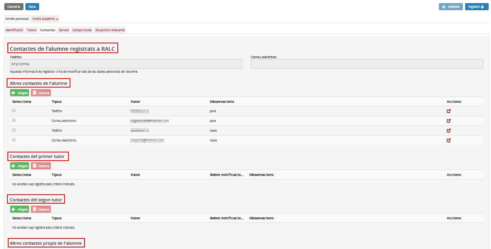

## Contactes

Aquesta pestanya conté tots els contactes que s'han introduït en diferents llocs de la fitxa de l'alumne. Hi ha dades que provenen del RALC i altres que no. També a l'inrevés, qualsevol contacte que s'especifiqui en aquesta pestanya també es veurà en el lloc corresponent de la fitxa de l'alumne.

*Imatge 1 - Contactes de la fitxa de l'alumne*

Els contactes s'agrupen de la manera següent:

* Contactes de l'alumne/a registrats al RALC: no es poden modificar a Esfer@.
* Altres contactes de l'alumne/a: vinculats al centre i a l'identificador de l’alumne, es corresponen a les mateixes dades d'‘Altres contactes’ de les dades identificatives de l’alumne.
* Contactes del primer tutor/a: vinculats al centre i a l'identificador del tutor o tutora. Si no s'ha especificat un primer tutor o tutora, aquest bloc es mostrarà buit i inhabilitat.
* Contactes del segon tutor/a: vinculats al centre i a l'identificador del segon tutor. Si no s'ha especificat un segon tutor o tutora, aquest bloc es mostrarà buit i inhabilitat.
* Altres contactes propis de l'alumne/a.

---