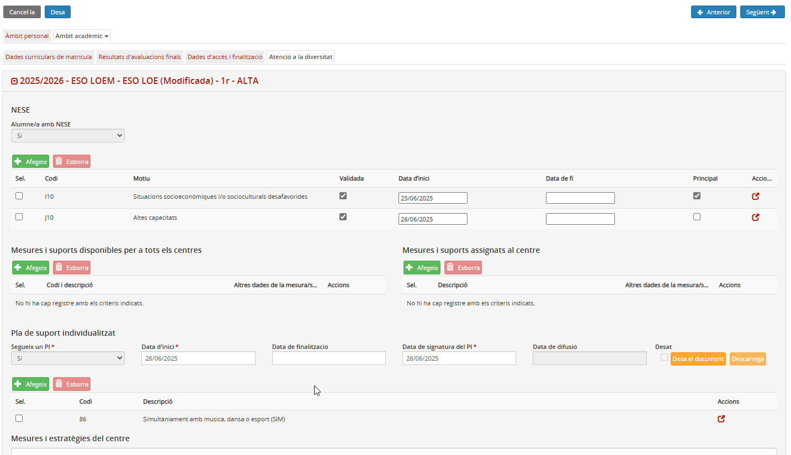
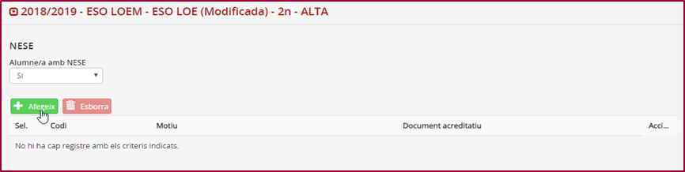
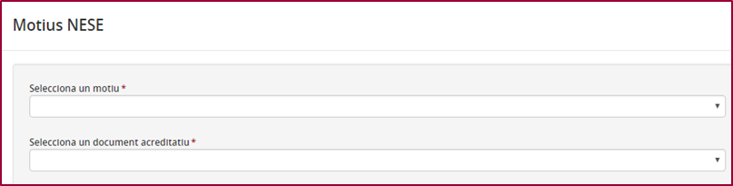
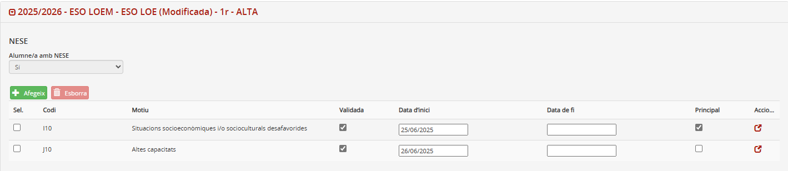
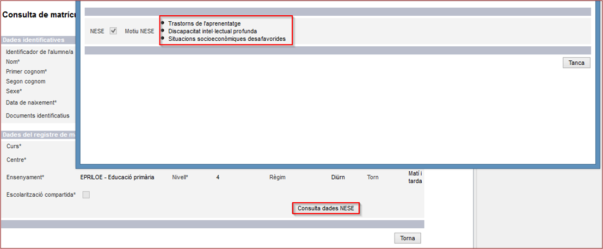
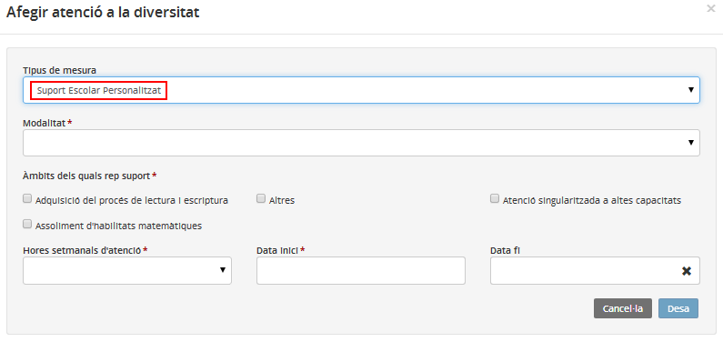
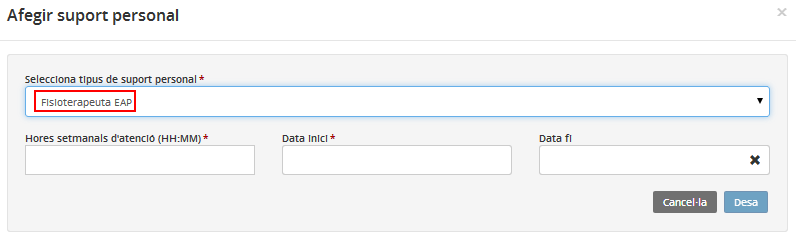
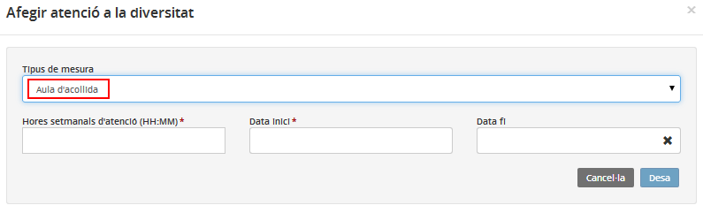
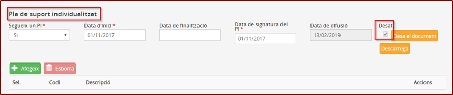
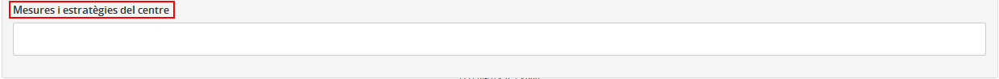

## Atenció a la diversitat

En aquesta pantalla es desen les mesures d'atenció a la diversitat de l'alumne.

Cal emplenar aquest apartat, si escau, per tal de tenir el màxim d'informació possible i actualitzada de l'alumne o l'alumna.

Les dades de les mesures d'atenció a la diversitat que es poden emplenar són:

* [Dades de les NESE](act_nese.md#dades-de-les-nese)
* [Mesures i suports disponibles per a tots els centres](act_nese.md#mesures-i-suports-disponibles-per-a-tots-els-centres)
* [Mesures i suports assignats al centre](act_nese.md#mesures-i-suports-assignats-al-centre)
* [Dades del Pla de suport individualitzat](act_nese.md#dades-del-pla-de-suport-individualitzat)
* [Mesures i estratègies del centre](act_nese.md#mesures-i-estrategies-del-centre)

*Imatge 1 - Accés a l'Atenció a la diversitat de l'àmbit acadèmic*

### Dades de les NESE

En aquest bloc s'especifiquen les dades de les NESE.  
  
Si s'especifica "Sí" al camp "Alumne/a amb NESE?", cal concretar:

* Especificar el/s motiu/s de NESE prement el botó .

*Imatge 2 - Incorporació d'un motiu de NESE*

\* El desplegable del camp document acreditatiu només mostra els documents associats a aquella NESE i es mostrarà al moment d’afegir el motiu NESE.

*Imatge 3 - Incorporació d'un motiu de NESE*

*Imatge 4 - Incorporació d'un motiu de NESE*

Els camps "Validada", "Data inici", "Data fi" i "Principal" no són editables, venen determinats per altres sistemes.
Només es poden eliminar motius NESE que no tinguin cap dels quatre camps anteriors informats.
Si es vol eliminar un motiu afegit, cal seleccionar-lo i prémer el botó .

Aquests motius s'introduiran automàticament al RALC:

*Imatge 5 - Incorporació d'un motiu de NESE*

---

### Mesures i suports disponibles per a tots els centres

En aquest bloc s'especifiquen les mesures i els suports que utilitza l'alumne o l'alumna, i per a cadascun d'ells cal detallar unes dades addicionals.

El centre ha de definir prèviament les mesures i els suports disponibles per a tots els centres a l'opció del menú "Atenció a la diversitat" del mòdul **Configuracions**.

  
  
Se’n poden afegir de nous i eliminar-ne d’existents.  
  
Per afegir una mesura o un suport a l'alumne o alumna, cal prémer el botó  d'aquest bloc. Segons l'opció que se selecciona, les dades addicionals que es demanen són diferents.

*Imatge 6 - Camps emplenables de la mesura de suport escolar personalitzat*

*Imatge 7 - Camps emplenables per afegir un suport escolar personalitzat - Fisioterapeuta EAP*  
  
  

---

### Mesures i suports assignats al centre

En aquest bloc de dades és on s'indiquen les mesures i els suports personals assignats al centre que necessita l'alumne. Segons el suport cal emplenar dades addicionals.

Les mesures i suports disponibles pel centre que es poden assignar són els que el centre té definits pel curs escolar en l'opció del menú **"Atenció a la diversitat"** del mòdul **"Configuracions"**, definits prèviament per les unitats administratives.

Per afegir una mesura i/o suport assignat al centre a l'alumne cal prémer el botó  d'aquest bloc.

*Imatge 8 - Camps emplenables de la mesura d'aula d'acollida*

---

### Dades del Pla de suport individualitzat

Quan, per diversos motius, és necessari adaptar l'ensenyament a un alumne o alumna, cal especificar-ho en aquest bloc de dades.

Cal emplenar aquest apartat, si escau, amb anterioritat a l'inici de l'avaluació final per poder marcar les opcions que s'ofereixen al currículum en relació amb el Pla individualitzat (PI).

Per a **educació primària, educació secundària obligatòria i batxillerat** els camps són els següents:

* **Segueix un PI**: Desplegable amb valors "Sí"/"No". Per defecte, hi surt "NO". Si l’alumne té alguna NESE que requereixi un PI, cal especificar-ho amb "Sí".
* **Data d'inici**
* **Data de finalització**
* **Data de signatura del PI**
* **Desa document** – Botó que permet desar el pla individualitzat de l’alumne o l'alumna en format PDF.
* **Descarrega** – Botó que permet descarregar el pla individualitzat de l’alumne en format PDF, sols si aquest ha estat desat amb anterioritat.
* **Data de difusió** – Només de lectura. S’actualitza de forma automàtica quan es produeixin canvis en el document del pla individualitzat.
* **Motiu/s del PI**: Desplegable amb codi i descripció dels motius del pla individualitzat.

Es poden afegir nous motius i eliminar-ne d’existents si s’ha marcat "Segueix un PI" amb un "Sí".

Si l’alumne té una NESE que comporta un pla individualitzat, ha de seleccionar el motiu “Per tenir NESE”.

La informació i les accions relacionades amb els documents dels plans individualitzats, es desen en l'àmbit de l'ensenyament, alumne i centre. Per tant, només estaran disponibles en l'última matrícula activa.

| **Motius del PI** | **Ensenyaments** | | | | **Observacions** |
| --- | --- | --- | --- | --- | --- |
| EINF | EPRI | ESO | BATX |
| a) Alumnes amb necessitats educatives especials |  |  |  |  | Aquest motiu requereix que el camp NESE estigui a "Sí" |
| b) Alumnat nouvingut incorporat tardanament al sistema educatiu |  |  |  |  |  |
| c) Suport lingüístic i social per accedir al currículum |  |  |  |  |  |
| d) Alumnat atès exclusivament en centres de salut, de Justícia Juvenil,…. |  |  |  |  |  |
| e) Reducció de la durada dels estudis en l’etapa |  |  |  |  |  |
| f) Estudis simultanis amb estudis de música, dansa o esport (SIM) |  |  |  |  | Aquest motiu requereix que el camp SIM estigui a "Sí" |
| g) NESE reconegudes en l’informe EAP de traspàs d’etapa |  |  |  |  |  |
| h) Mesures addicionals i/o intensives per assolir CB |  |  |  |  |  |
| i) Criteris d'avaluació diferents al curs corresponent |  |  |  |  |  |
| j) Trastorns de l’aprenentatge o PI com a requisit |  |  |  |  |  |

Els **ensenyaments de formació professional o arts plàstiques i disseny**, tenen disponible el camp següent:

* **Adaptació curricular**: Desplegable amb valors "Sí/No". Per defecte, hi surt "No".

S’ha afegit un control de càrrega de document acreditatiu:

*Imatge 9 - Control de càrrega de document acreditatiu*

---

### Mesures i estratègies del centre

Aquest camp és per a text lliure on el centre podrà indicar altres mesures o estratègies que s'apliquen a l’alumne o alumna.

*Imatge 10 - Camp per indicar les mesures i estratègies del centre*

No es farà cap control sobre aquest apartat.  
  

---