# Currículum del centre

* [Què és](curri_centre.md#que-es)
* [Com s'hi accedeix](curri_centre.md#com-shi-accedeix)
* [Quines operacions s'hi poden fer](curri_centre.md#quines-operacions-shi-poden-fer)

  + [Consultar](curri_centre.md#consultar)
  + [Crear-ne un de nou fent una còpia](curri_centre.md#crear-ne-un-de-nou-fent-una-copia)
  + [Crear-ne un a partir d’un currículum base](curri_centre.md#crear-ne-un-a-partir-dun-curriculum-base)
  + [Modificar](curri_centre.md#modificar)
  + [Esborrar](curri_centre.md#esborrar)
  + [Cas particular de les ZER](curri_centre.md#cas-particular-de-les-zer)

### Què és

El **currículum del centre**, és una agrupació d'elements curriculars i hores relacionades (segons l'ensenyament), que facilita l'assignació del currículum a l'alumne en el procés de matrícula.

En matricular un alumne, ja sigui una matrícula assignada al centre o una matrícula de continuïtat, és imprescindible assignar un currículum a l'alumne. És convenient, per tant, haver-los definit prèviament al moment de matricular l'alumnat en l'opció del menú **Currículum del centre** del mòdul **Currículums**.

  
Per defecte, hi ha un currículum del centre, **currículum base**, definit per a cada nivell dels ensenyaments dels quals el centre té grups autoritzats. Aquest currículum del centre inclou els continguts i les hores, si és el cas, que estableix la normativa.

En funció de l'ensenyament, el centre té certa autonomia per a:

* establir els continguts que s'ofereixen en cada nivell;
* concretar les hores setmanals, si correspon, o anuals en el cas dels cicles formatius;
* afegir els elements curriculars del centre al currículum base si l'ensenyament ho permet.

Quan es crea un currículum del centre cal concretar els elements curriculars, a tots els ensenyaments, i el nombre d'hores en els ensenyaments que ho requereixen.

Sovint, per a un mateix ensenyament i nivell, s'assignen currículums diferents perquè l'alumne pot triar la segona llengua estrangera, si cursa o no religió, o pot seleccionar una matèria optativa. En aquests casos, el centre pot optar per definir més d'un currículum del centre per ensenyament i nivell, i assignar-los en el procés de matrícula convenientment.

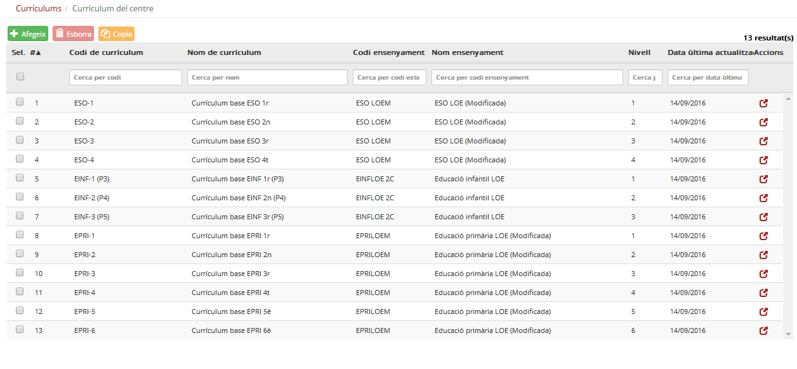*Imatge 1 - Llista de currículums del centre en un institut escola*
  
  

---

### Com s'hi accedeix

Per accedir-hi, heu de seleccionar l'opció del menú **Currículum del centre** del mòdul **Currículums**.

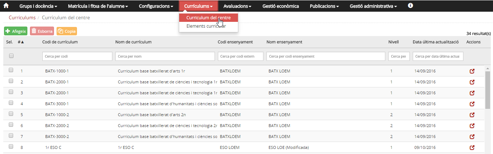*Imatge 2 - Llista de currículums del centre*
En aquesta imatge es pot veure:

* Una taula amb els currículums que s'han creat. Per a cada currículum, es mostra el codi del currículum, el nom, el codi de l'ensenyament, el nivell, la data de la darrera actualització i la icona  per consultar-ne els detalls.
* A la part superior de la taula hi ha els botons  .
* A la capçalera de la taula hi ha els noms dels camps. A la fila de sota hi ha els filtres per facilitar la cerca de currículums.

Quan es prem la icona  s'accedeix a les dades del currículum que es vol consultar.
  
  
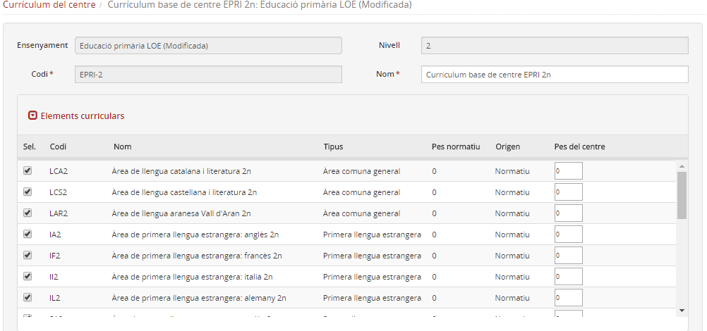*Imatge 3 - Detall d'un currículum del centre*
  
  
En aquesta imatge es pot veure:

* Una capçalera amb **l'ensenyament, nivell, codi i nom del currículum**.
* Una taula amb els elements curriculars d'aquest ensenyament i nivell. Per a cada element curricular es mostra la informació següent:

  + **Casella de selecció:** Per indicar si l'element curricular forma part del currículum.
  + **Codi, Nom, Tipus, Pes normatiu i Origen:** Són dades de l'element curricular.
  + **Pes del centre:** És un nom genèric que, en el cas d'EINF, EPRI ha d'estar sempre a 0, no s'utilitza en aquests ensenyaments; a ESO i batxillerat correspon a les hores setmanals; en el cas dels cicles formatius correspon a les hores del mòdul o de les unitats formatives, i en el cas del CFAS (cicle formatiu d'arts plàstiques i disseny de grau superior) correspon al nombre de crèdits ECTS (sistema europeu de transferència de crèdits).

En els ensenyaments en què el pes del centre faci referència a les hores, la suma de les hores dels elements curriculars ha de coincidir amb les hores de classe setmanals que faci l'alumne.

* A **ESO** i **batxillerat** són **29** hores.
* En els **cicles formatius** l'aplicació no fa cap control sobre el nombre d'hores.

  
  

---

### Quines operacions s'hi poden fer

* [Consultar](curri_centre.md#consultar) - veure la llista de currículums del centre.

* [Crear-ne un de nou fent una còpia](curri_centre.md#crear-ne-un-de-nou-fent-una-copia) - L'aplicació fa una còpia d'un currículum existent, amb el mateix nom i continguts. Al codi hi afegeix la paraula "còpia". Després de copiar-lo, accedint a la funció [Modificar](curri_centre.md#modificar), el programa permet canviar-ne el nom i modificar-ne els elements curriculars i les hores.

* [Crear-ne un a partir d’un currículum base](curri_centre.md#crear-ne-un-a-partir-dun-curriculum-base) - Es crea un currículum nou, amb tots els elements curriculars que hi ha en un currículum base. En crear-lo s'hi ha de posar un codi, un nom, especificar si cal afegir o treure elements curriculars i, si és el cas, modificar-ne les hores.

* [Modificar](curri_centre.md#modificar) - Aquesta funció permet canviar el nom del currículum i modificar-ne els elements curriculars i les hores.

* [Esborrar](curri_centre.md#esborrar) - Permet esborrar els currículums del centre que ja no interessi mantenir[1)](curri_centre.md#1). El programa controla que, per a cada ensenyament i nivell, hi hagi almenys un currículum del centre, i no deixa esborrar el currículum si aquest és el darrer que hi ha.

* [Cas particular de les ZER](curri_centre.md#cas-particular-de-les-zer) - Totes les escoles d'una ZER comparteixen el Projecte educatiu. En aquest cas, la ZER defineix els currículums comuns per a tots els centres; posteriorment, cada centre pot fer-ne una petita adaptació.

Tots els canvis que es facin a un currículum del centre no tenen cap efecte en el currículum dels alumnes que ja estan matriculats.   
El currículum serveix de patró al fer una nova matrícula.

  
  
Els currículums base que es mostren a l'aplicació contenen totes les opcions de religió i llengües estrangeres.

A l'Educació Infantil i Primària cal desmarcar aquelles opcions que el centre no ofereix i, per tant, cap alumne cursarà.

  
  

---

#### Consultar

Per veure els currículums del centre s'ha d'escollir l'opció **Currículum del centre** del mòdul **Currículums**.
  
  
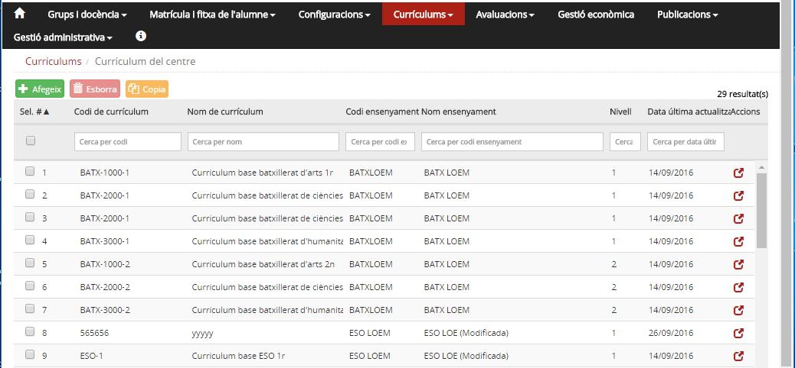*Imatge 4 - Llista de currículums del centre*
  
  

---

#### Crear-ne un de nou fent una còpia

Seleccionar l'opció de menú **Currículum del centre** del mòdul **Currículums**.
  
  
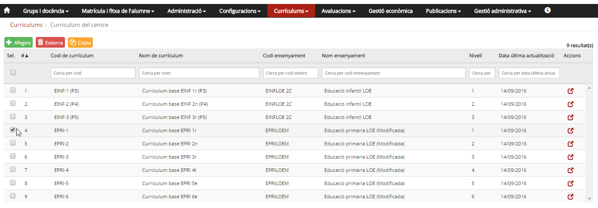*Imatge 5 - Còpia d'un currículum*
  
**2)** Marcar la casella de selecció corresponent al currículum que es vol copiar [2)](curri_centre.md#2)
  
**3)** Prémer el botó .
  
  

---

#### Crear-ne un a partir d’un currículum base

**1)** Seleccionar l'opció del menú **Currículum del centre** del mòdul **Currículums**.
  
**2)** Prémer el botó .
  
**3)** Introduir les dades[3)](curri_centre.md#3)
  
  
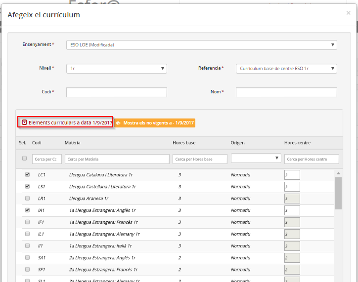*Imatge 6 - Formulari per entrar les dades quan es crea un currículum del centre*
  
  
**4)** Desplegar el currículum i concretar les matèries.  
Premeu "Elements curriculars a data 01/09/YYYY" i concreteu el currículum.
  
  
**5)** Prémer el botó .

---

#### Modificar

**1)** Seleccionar l'opció del menú **Currículum del centre**
del mòdul **Currículums**.
  
  
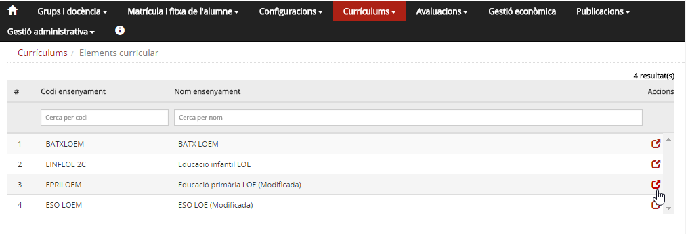*Imatge 7 - Llista de currículums del centre*
  
  
**2)** Prémer la icona  del currículum que es vol editar.  
*Imatge 8 - Edició de les dades d'un currículum*
  
  
**3)** Modificar les dades que correspongui. Podeu marcar o desmarcar matèries, o modificar les hores assignades.
  
**4)** Prémer el botó .
  
  

---

#### Esborrar

**1)** Seleccionar l'opció del menú **Currículum del centre**
del mòdul **Currículums**.
  
  
*Imatge 9 - Selecció del currículum que es vol esborrar*
  
  
**2)** Marcar la casella corresponent al currículum que es vol esborrar. [4)](curri_centre.md#4)
  
  
**3)** Prémer el botó .
  
  

---

### Cas particular de les ZER

\* [Crear els currículums de la ZER i fer-ne la rèplica a les escoles](curri_centre.md#crear-els-curriculums-de-la-zer-i-fer-ne-la-replica-a-les-escoles)  
\* [Crear els currículums del centre a les escoles de la ZER](curri_centre.md#crear-els-curriculums-del-centre-a-les-escoles-de-la-zer)

#### Crear els currículums de la ZER i fer-ne la rèplica a les escoles

La ZER pot crear els currículums del centre amb totes les funcions, tal com s'ha descrit [anteriorment](curri_centre.md#anteriorment).
  
En el cas de les ZER, en accedir a l'opció del menú **Currículum del centre** del mòdul **Currículums**, el programa mostra tots els currículums del centre creats per la ZER.  
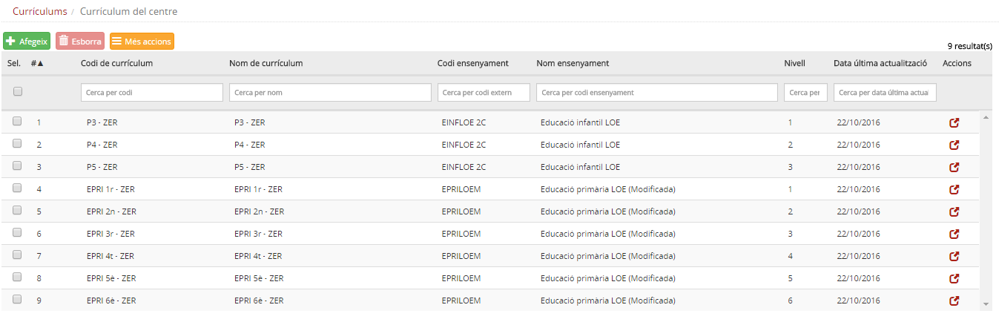*Imatge 10 - Llista de currículums de centre creats per la ZER*
  
A la part superior de la taula hi ha tres botons   .

* El comportament dels botons [Afegeix](curri_centre.md#afegeix) i [Esborra](curri_centre.md#esborra) és anàleg al que s'ha explicat abans.
* En prémer el botó  es despleguen dos botons 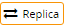.

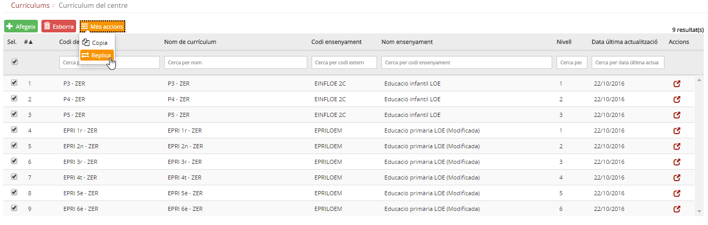*Imatge 11 - Currículums de la ZER marcats per fer una rèplica a les escoles*

* El funcionament del botó [Copiar](curri_centre.md#copiar) és el mateix que s'ha explicat per copiar currículums en altres centres.
* En prémer el botó , es mostra una pantalla en què es demana la confirmació de l'acció.

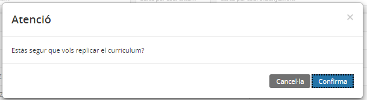*Imatge 12 - Pantalla de confirmació per fer les rèpliques*

* Si es prem 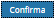, el programa fa la rèplica dels currículums marcats a totes les escoles de la ZER.

#### Crear els currículums del centre a les escoles de la ZER

La gestió del currículum a les escoles de la ZER és molt semblant a la gestió que es fa a qualsevol altre centre. L'escola pot modificar i copiar els currículums del centre a partir del currículum que ha creat la ZER per a totes les escoles.
  
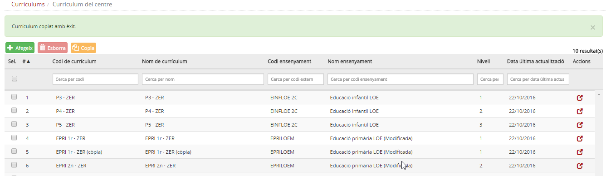*Imatge 13 - Relació de currículums de centre en una escola de la ZER*
  
Observeu que el centre ha creat una còpia d'un dels currículums

---

[1)](curri_centre.md#1)
Si s'esborra un currículum del centre, no afecta el currículum de l'alumne

[2)](curri_centre.md#2)
Es pot fer la còpia de més d'un currículum a la vegada

[3)](curri_centre.md#3)
Escollir l'ensenyament, el nivell, el currículum de referència. Emplenar el codi i el nom.

[4)](curri_centre.md#4)
Es pot esborrar més d'un currículum a la vegada.