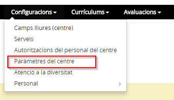
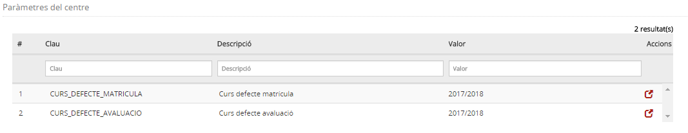
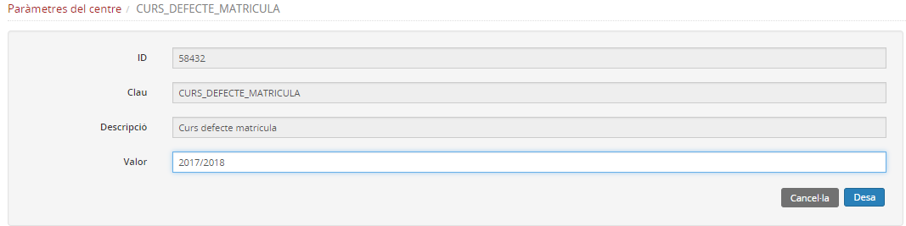

# Paràmetres del centre

* [Què són](param_mat.md#què-són)
* [Com s’hi accedeix](param_mat.md#com-shi-accedeix)
* [Quines operacions s'hi poden fer](param_mat.md#quines-operacions-shi-poden-fer)

## Què són

Els **paràmetres del centre** són els valors que el centre preestableix per tal de facilitar el procés de matrícula i d'avaluació.

En aquesta opció del menú **Configuracions** es defineix:

* en quin curs es vol treballar per defecte en la matriculació;
* en quin curs es vol treballar per defecte en l'avaluació.

---

## Com s’hi accedeix

Per accedir-hi, heu de seleccionar l'opció del menú **Paràmetres del centre** del mòdul **Configuracions**.

*Imatge 1 - Pantalla per seleccionar Paràmetres del centre*
  
  

---

## Quines operacions s'hi poden fer

Es pot definir el curs que cal mostrar per defecte a la matrícula i el curs per defecte a les avaluacions.

Si es vol canviar el curs per defecte, es prem la icona  del camp corresponent, i a la finestra emergent s'emplena el curs per defecte amb què es vol treballar.

Es prem el botó **Desa** per mantenir-ne els canvis.

*Imatge 2 - Llista de cursos per defecte*

*Imatge 3 - Selecció del valor del curs per defecte*  
  
  

---