# Registre de correspondència

* [Què és](correspondencia.md#que-es)
* [Com s’hi accedeix](correspondencia.md#com-shi-accedeix)
* [Quines operacions s'hi poden fer](correspondencia.md#quines-operacions-shi-poden-fer)

  + [Exercicis](correspondencia.md#exercicis)
  + [Contactes](correspondencia.md#contactes)
  + [Temes](correspondencia.md#temes)
  + [Registres d'entrada](correspondencia.md#registres-dentrada)
  + [Registres de sortida](correspondencia.md#registres-de-sortida)
  + [Extracció dels moviments](correspondencia.md#extraccio-dels-moviments)

### Què és

El Registre de correspondència és una funcionalitat que permet registrar els documents, comunicacions i informacions que rep o tramet el centre docent.

### Com s'hi accedeix

S'accedeix a través del menú de Gestió administrativa.
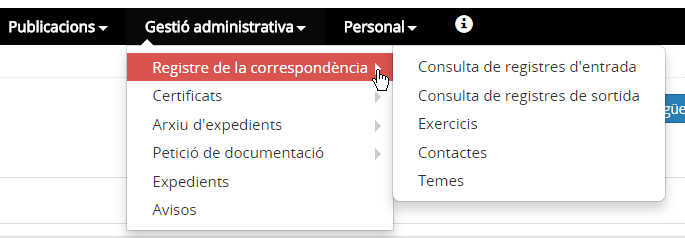*Imatge 1 - Accés a Registre de correspondència*

### Quines operacions s'hi poden fer

* **Exercicis**: consultar els exercicis existents, crear exercicis nous i canviar l'estat d'un exercici.
* **Contactes**: consultar els contactes, crear-ne de nous, modificar les dades d'un contacte i donar de baixa un contacte, si escau.
* **Temes**: consultar els temes, crear-ne de nous, modificar un tema i donar de baixa un tema, si escau.
* **Registres d'entrada**: consultar els registres d'entrada, registre d'un moviment d'entrada, i editar-lo o anul·lar-lo, si escau.
* **Registres de sortida**: consultar els registres de sortida, registre d'un moviment de sortida, i editar-lo o anul·lar-lo, si escau.
* **Extracció dels moviments**: extracció en format excel dels registres d'entrada o sortida.

---

#### Exercicis

Aquesta opció de menú presenta la llista dels anys existents al registre i també l'estat de cadascun dels anys definits.
  
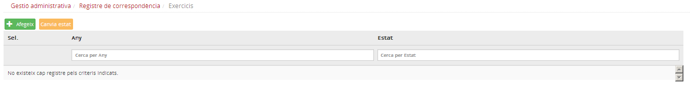*Imatge 2 - Pantalla de l'opció Exercicis*
  
Per crear un nou exercici cal clicar al botó , i definir-lo a la finestra corresponent:
  
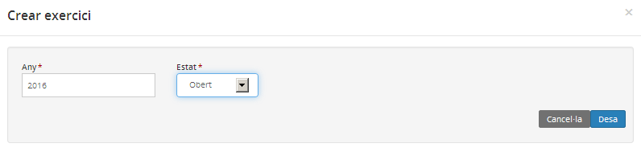*Imatge 3 - Finestra per crear un exercici*
  
L'exercici que s'hagi creat es mostrarà a la llista d'exercicis:
  
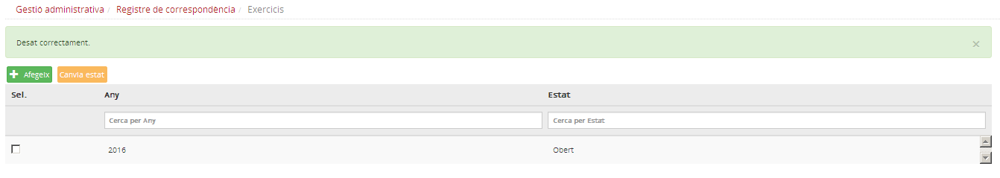*Imatge 4 - Exercicis*
  
  

---

#### Contactes

Aquesta opció permet crear la llista de contactes, és a dir, de remitents i destinataris de la correspondència.
  
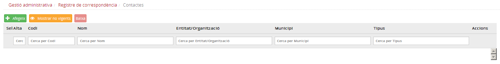*Imatge 5 - Pantalla per afegir un contacte*
  
Per crear un nou contacte cal clicar al botó , i definir-lo a la finestra corresponent:
  
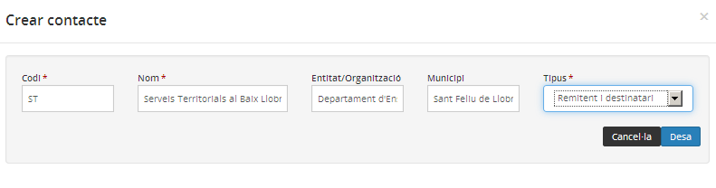*Imatge 6 - Finestra per crear un contacte*
  
  
La creació d'un contacte nou requereix emplenar la informació següent:

* **Codi**: el que vulgui l'usuari.
* **Nom**: el nom del contacte que es mostrarà a la graella.
* **Tipus**: els contactes poden ser de tres tipus: remitents, destinataris o remitents i destinataris.

Opcionalment també es poden emplenar els camps:

* **Entitat/Organització** a la qual pertany el contacte.
* **Municipi** on està localitzat el contacte.

El contacte que s'hagi creat es mostrarà a la llista de contactes:
  
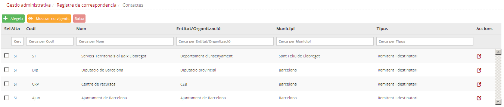*Imatge 7 - Llista de contactes*
  
Els contactes creats no es poden eliminar, però sí que es poden donar de baixa; d'aquesta manera ja no es podran utilitzar.
  
Per fer-ho cal seleccionar el contacte o contactes que es desitgi i prémer el botó .
  
El botó  amaga els contactes donats de baixa.
  
Aquest botó alterna amb , que els farà visibles novament.
  
  

---

#### Temes

Aquesta opció permet crear els temes que es necessiten per registrar la correspondència.
  
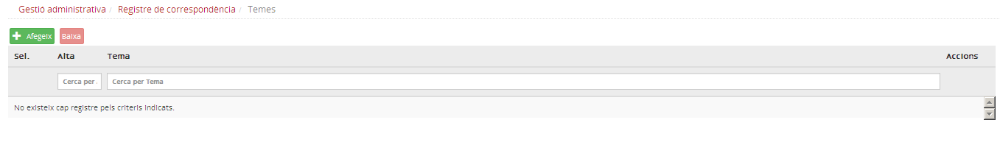*Imatge 8 - Temes*
  
Per crear un tema nou cal clicar al botó , i definir-lo a la finestra corresponent:
  
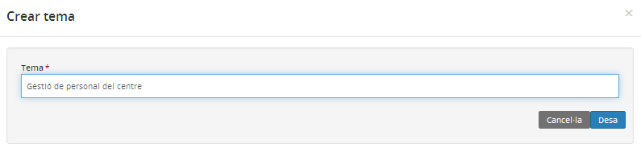*Imatge 9 - Crear un tema*
  
El tema que s'hagi creat es mostrarà a la llista de temes:
  
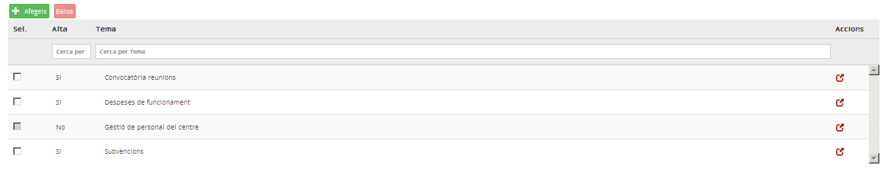*Imatge 10 - Llista de temes*
  
Els temes creats no es poden esborrar, però si n'hi ha que ja no són necessaris es poden donar de baixa.
  
Cal seleccionar el tema o temes que es desitgi i prémer el botó
.
  
  

---

#### Registres d'entrada

Aquesta opció permet enregistrar entrades de documents.
Els documents, un cop enregistrats, es mostren en una graella ordenada per número d'assentament de forma decreixent.
Aquesta graella mostra una mínima informació de cada document. Al final de cada registre hi ha la icona , que permet accedir al detall del registre.
  
  
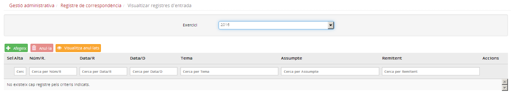*Imatge 11 - Pantalla per enregistrar entrades*
  
Per enregistrar un nou document d'entrada s'ha de clicar al botó .
A continuació, a la finestra modal, s'han d'emplenar les dades del document:
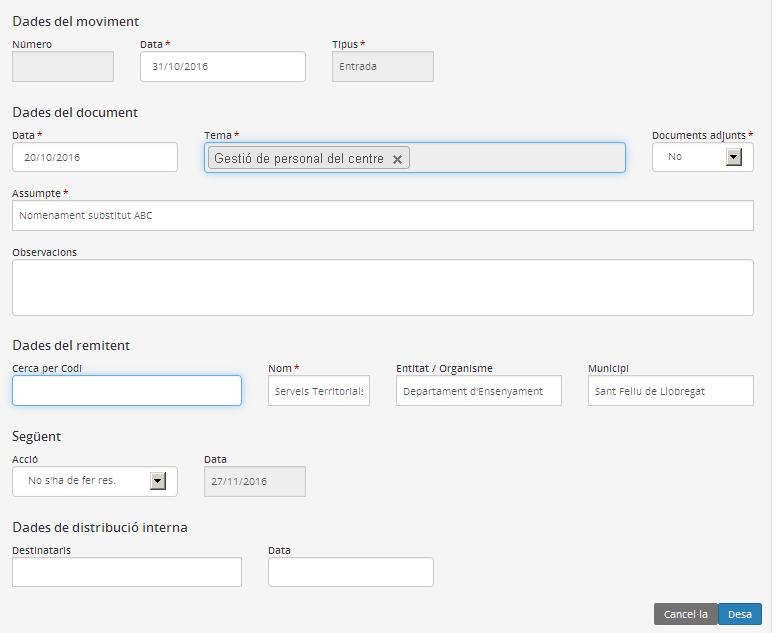*Imatge 12 - Registre d'entrada d'un document*
  
La informació del document que cal enregistrar és la següent:

* **Dades del moviment**

  + Número: l'emplena el sistema automàticament.
  + Tipus: l'emplena el sistema automàticament.
  + Data: correspon a la data de recepció del document.
* **Dades del document**

  + Data: la data del document.
  + Tema: s'ha de seleccionar entre els temes creats.
  + Documents adjunts: Sí / No.
  + Assumpte: breu descripció del contingut del document.
  + Observacions: les que l'usuari cregui oportunes.
* **Dades del remitent** (hi ha un camp de cerca)

  + Nom
  + Entitat / Organisme
  + Municipi
* **Següent**

  + Acció: cal triar entre "No s'ha de fer res", "S'espera resposta" o "S'ha rebut resposta".
  + Data: la posa el sistema automàticament.
* **Dades de distribució interna**

  + Destinataris: si s'ha de traspassar les dades a algú.
  + Data: data en què es traspassa.

Per acabar s'ha de clicar al botó .
  
El nou registre es mostrarà a la llista de documents d'entrada.
  
Els registres de documents no es poden esborrar, però és possible anul·lar-los. Per fer-ho cal seleccionar el registre i prémer el botó .
El botó  mostrarà a la pantalla els registres anul·lats. Aquest botó alterna amb l'opció , que amaga els registres anul·lats.
  
  

---

#### Registres de sortida

Aquesta opció del menú permet enregistrar els documents de sortida.
  
El funcionament és anàleg al de registre d'entrada.

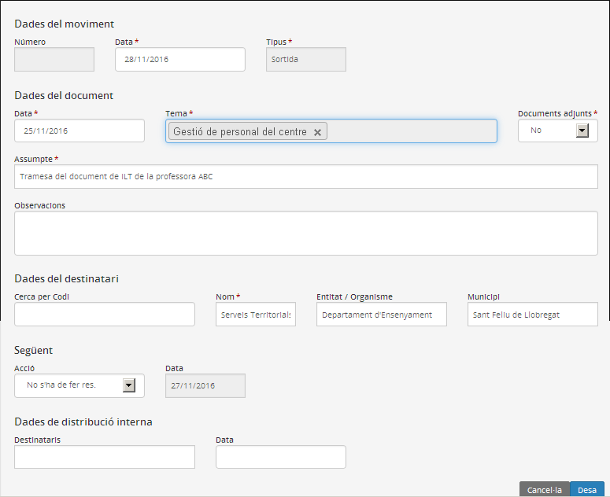*Imatge 13 - Registre de sortida d'un document*
  
  

---

#### Extracció dels moviments

L'aplicació té l'opció d'obtenir, en format excel, la relació de registres d'entrada o sortida.
  
  

---