# Petició de la custòdia (de l'expedient de l'alumne/a)

* [Què és](traspas_custodia.md#què-és)
* [Com s’hi accedeix](traspas_custodia.md#com-shi-accedeix)
* [Quines operacions es poden fer](traspas_custodia.md#quines-operacions-es-poden-fer)

  + [Traspàs de custòdia entre centres Esfer@](traspas_custodia.md#traspàs-de-custòdia-entre-centres-esfer)

    - [Actuacions prèvies](traspas_custodia.md#actuacions-prèvies)
    - [Fer una petició de documentació](traspas_custodia.md#fer-una-petició-de-documentació)
    - [Respondre una petició de documentació](traspas_custodia.md#respondre-una-petició-de-documentació)
    - [Rebre la documentació](traspas_custodia.md#rebre-la-documentació)
  + [Traspàs de documentació d'un centre Esfer@ a un centre NO Esfer@](traspas_custodia.md#traspàs-de-documentació-dun-centre-esfer-a-un-centre-no-esfer)
  + [Traspàs de documentació d'un centre NO Esfer@ a un centre Esfer@](traspas_custodia.md#traspàs-de-documentació-dun-centre-no-esfer-a-un-centre-esfer)

## Què és

Cada alumne té un [únic expedient](../../mgad1/gest_adm/exp.md) per a un ensenyament. L'expedient recull la informació acadèmica de l'alumne de l'ensenyament corresponent. El centre on inicia l'ensenyament custodia l'expedient de l'alumne i l'anirà completant amb els resultats acadèmics de cada nivell fins a finalitzar l'ensenyament. Llavors l'expedient quedarà tancat.
  
  
Quan un centre ha matriculat un alumne que ja havia iniciat l'ensenyament en un altre centre (o bé havia estat anteriorment matriculat en un altre centre), i que per tant ja té expedient, ha de sol·licitar l'expedient al centre del que procedeix. Però no tots els centres de procedència o destinació estan gestionats amb Esfer@, per tant es poden donar diverses situacions, en cadascuna de les quals la forma d'actuació serà diferent:

---

## Com s'hi accedeix

S'accedeix a través de l'opció del menú **Petició de documentació** del mòdul **Gestió administrativa**.
*Imatge 1 - Accés al menú Petició de documentació*
  

---

## Quines operacions es poden fer

Les operacions que es poden fer depenen de l'eina de gestió dels centres que intervenen en el trasllat de l'alumne.
  
  
No tots els centres de procedència o destinació estan gestionats amb Esfer@, per tant es poden donar diverses situacions:

1. L'alumne es trasllada d'un centre a un altre ambdós gestionats amb **Esfer@**.
2. L'alumne es trasllada d'un centre **Esfer@** a un centre **NO Esfer@**.
3. L'alumne es trasllada d'un centre **NO Esfer@** a un centre **Esfer@**.

En cada cas la forma d'actuació serà diferent.
  
  

---

### Traspàs de custòdia entre centres Esfer@

Quan un alumne es trasllada d'un centre a un altre i ambdós estan gestionats amb Esfer@ parlem de **Traspàs de custòdia de l'expedient**. En aquest cas tot el procediment es realitza directament a l'aplicació.
  
  
Intervenen dos centres:

* Centre del que ha marxat l'alumne: centre **proveïdor**, el que té la custòdia de l'expedient (en endavant **Centre A**).
* Centre on s'ha matriculat l'alumne: centre **peticionari**, el que sol·licita la custòdia de l'expedient (en endavant **Centre B**).

Cadascun dels centres ha de fer la seva gestió en aquest procediment.
  
  
Bàsicament el procés consta de quatre passos:

1. El centre B comprova que a la FDA, [\*\*Dades d’accés i finalització\*\*](../../mgad1/gest_adm/peticio_documentacio/peticio_doc.md#dades-daccés-i-finalització) de l’Àmbit acadèmic, hi consta el nom del centre que té la custòdia.
2. El centre B formalitza i [\*\*signa\*\*](../../mgad1/gest_adm/peticio_documentacio/peticio_doc.md#signa) (direcció) la petició de documentació al centre A.
3. El centre A fa la [\*\*resposta\*\*](../../mgad1/gest_adm/peticio_documentacio/respota_peticio_docum.md) a la petició de documentació i la [\*\*signa\*\*](../../mgad1/gest_adm/peticio_documentacio/respota_peticio_docum.md#signa) (direcció) al centre B.
4. El centre B [\*\*rep la tramesa\*\*](../../mgad1/gest_adm/peticio_documentacio/recepcio-docum.md) .

Per tant, el procés l'ha d'iniciar el centre B, el centre que demana la custòdia de l'expedient.
  

Per a més informació del procés, [visualitzeu el vídeo enllaçat](https://docs.google.com/presentation/d/15MTCSqK4A_szbiXJBVMIqdTz5Bp1J1UW3wlh8S-Y-CY/edit).

---

#### Actuacions prèvies

Abans d'iniciar el procés del traspàs de custòdia són imprescindibles dues accions:

1. El centre A ha d'**[arxivar l'expedient l'alumne](../../mgac/gadmin/arx_expe.md)**, després d'haver-lo donat de baixa.
2. El centre B ha de **completar les dades de procedència** a la fitxa de l'alumne, després d'haver-lo matriculat.

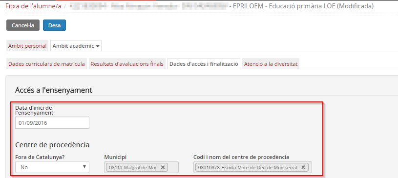*Imatge 2 - Completar les dades de procedència* 
  

---

#### Centre B: Fer una petició de documentació

El centre B efectua la **petició de documentació** al centre A.   
Accediu a la **Petició de documentació**:
  
  
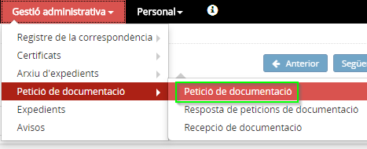*Imatge 3 - Accés al menú Petició de documentació*
  
  
El programa mostra tres apartats:

* **Formulari de cerca**
* **Alumnes que no tenen formalitzada la petició de documentació**
* **Alumnes amb petició**

En el formulari de cerca, empleneu els camps de **Cerca**: Observareu que en el camp **Centre de procedència**, el desplegable us mostrarà la relació de centres dels alumnes nous que prèviament hàgiu informat al programa.
  
  
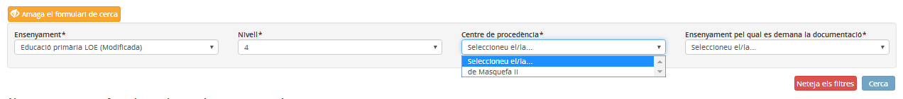*Imatge 4 - Cerca dels alumnes*

A la secció **Alumnes que no tenen formalitzada la petició de documentació** marcar els alumnes als quals s'ha de demanar la custòdia i prémer el botó [**Nova petició**]
  
  
*Imatge 5 - Selecció dels alumnes* 
  
  
La petició estarà creada en estat **Pendent de signatura**. La signatura de la petició l'ha de fer un membre de l'equip directiu. Es tracta únicament de seleccionar la petició, prémer el botó [**Més accions**] i clicar a l'opció **Signa petició**.
  
  
*Imatge 6 - Signar la petició de documentació* 
  
  
La petició de documentació quedarà **Pendent de resposta**.
  
  
*Imatge 7 - Petició pendent de resposta* 
  

Si el centre A **no** ha arxivat l'expedient, l'aplicació respondrà amb un missatge informant "**No hi ha cap expedient per l'alumne i l'ensenyament**".

  

---

#### Centre A: Respondre una petició de documentació

El centre A rep una petició de documentació.
  
Accediu al menú **Resposta de peticions de documentació**:
  
  
*Imatge 8 - Accés a Resposta de peticions de documentació* 
  
  
El programa mostra un formulari de cerca, en el desplegable **Centre peticionari** es mostra la relació de centres que ens han fet petició de documentació. És imprescindible triar el **centre peticionari** (el que ha emès la petició) i l'**ensenyament** del qual es demana la custòdia:
  
  
*Imatge 9 - Cerca de peticions* 
  
  
Opcionalment podeu consultar el **detall** de la petició clicant la icona de detall.
  
  
*Imatge 10 - Detall de la petició* 
  
  

Recordeu que per poder fer el traspàs, cal que la matrícula de l'alumne estigui en estat de baixa i haver arxivat l'expedient.

Seleccionant la petició s'activen les opcions del botó [**Més accions**]. Aquestes opcions són:

* **Signa la tramesa**
* **Tanca per error**
* **Traspassa la documentació**

**Signa la tramesa**  
Si la petició és correcta, s'ha de clicar aquesta opció.
  
  
*Imatge 11 - Signa la tramesa* 
  
  
La petició quedarà **Pendent de signar**:
  
  
*Imatge 12 - Petició pendent de signar* 
  
 **Traspassa la documentació**  
Heu de fer aquesta segona acció per fer efectiu el traspàs de la documentació, per la qual cosa, s'ha de seleccionar la petició signada, prémer de nou el botó [**Més accions**] i clicar l'opció **Traspassa la documentació**.
  
  
*Imatge 13 - Traspassa la documentació* 
  
  
El traspàs estarà pendent de l'acceptació del centre peticionari (Centre B).
  
  
*Imatge 14 - Documentació pendent d'acceptació* 
  
  
**Tanca per error**  
Si la petició és errònia (d'un alumne que no estava al centre, per exemple), cal seleccionar aquesta opció. En aquest cas es finalitza el procés. El centre que havia fet la petició podrà iniciar una altra si és el cas.
  
  
*Imatge 15 - Tanca per error* 
  
  
El centre peticionari veurà que la seva petició ha estat tancada:
  
  
*Imatge 16 - Petició Tancada per error*
  
  

---

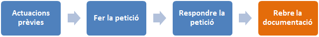

#### Rebre la documentació

Quan el centre proveïdor (centre A) ha fet la tramesa de la documentació, el centre B ha de comprovar que és correcta, i acceptar-la o rebutjar-la en cas contrari.
  
  
Cal anar a **Recepció de documentació** de l'opció del menú **Petició de documentació** del mòdul **Gestió administrativa**:
  
  
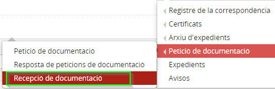*Imatge 17 - Accés a recepció de documentació* 
  
  
**Cercar** la petició de la qual s'ha rebut la custòdia:
  
  
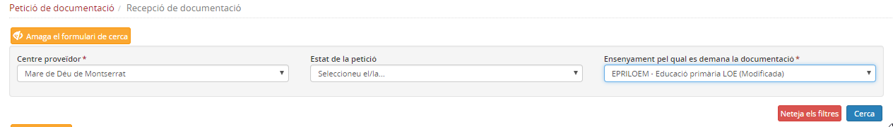*Imatge 18 - Cerca petició* 
  
  
Veure de quin o quins alumnes s'ha rebut la informació i **comprovar** la informació rebuda a **Dades d'accés i finalització** a l'opció del menú de l'**àmbit acadèmic** del mòdul **fitxa de l'alumne/a**.

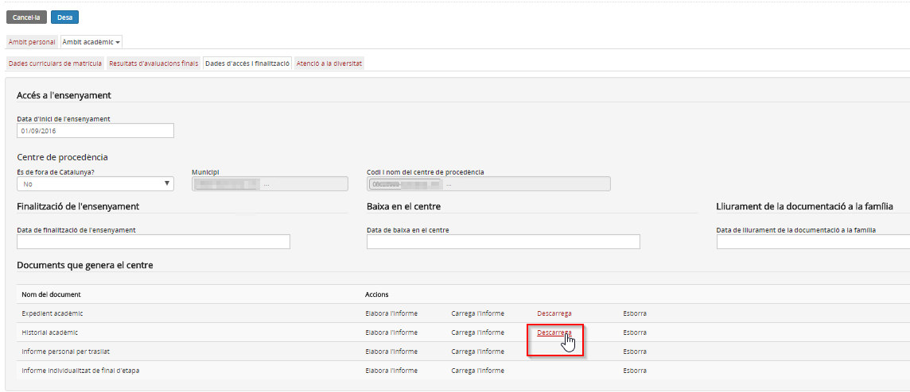*Imatge 19 - Accés a Comprovar els documents amb la informació acadèmica rebuda*
  
Si es mostra la informació de tots els cursos anteriors correctament, s'ha d'acceptar la documentació.
  
  
Accedir novament al menú **Recepció de documentació**, **cercar** la tramesa, **seleccionar-la**
  
  
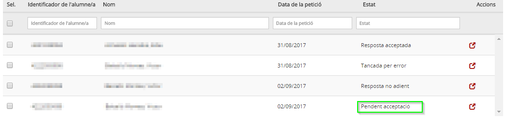*Imatge 20 - Cerca petició revisada* 
  
  
Prémer el botó [**Més accions**] i clicar l'opció **Resposta acceptada**.
  
  
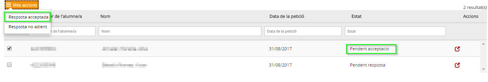*Imatge 21 - Resposta acceptada* 
  
  
Els resultats de les avaluacions finals de cursos anteriors quedaran incorporats a la fitxa de l'alumne i el centre peticionari (centre B) ja tindrà la custòdia de l'expedient, per la qual cosa podrà generar la documentació acadèmica de l'alumne (expedient i historial) quan ho necessiti.
  
  
Si al revisar la informació rebuda de l'alumne s'observa que està incompleta o que les dades no corresponen a l'alumne sol·licitat, s'ha de rebutjar la documentació.
  
En aquest cas, després de **cercar** la tramesa, **seleccionar-la**, s'ha de prémer el botó [**Més accions**] i clicar l'opció **Resposta no adient**.
  
  
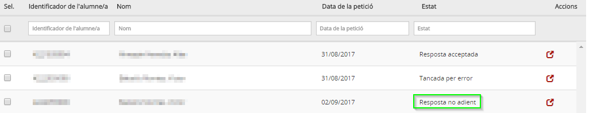*Imatge 22 - Resposta no adient*
  
  
Amb aquesta acció la petició ha quedat tancada. El centre peticionari (centre B) haurà d'iniciar una **nova petició**.
  
  
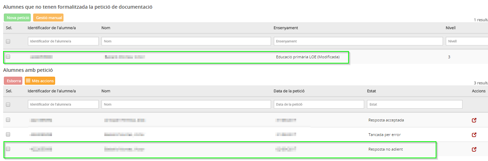*Imatge 23 - Nova petició d'una amb resposta no adient*
  
  

---

### Traspàs de documentació d'un centre Esfer@ a un centre NO Esfer@

Si l'alumne es trasllada del centre a un centre **NO Esfer@**, caldrà elaborar la documentació que determina la normativa en paper per a trametre-la al centre de destinació de l'alumne.
  
  

---

### Traspàs de documentació d'un centre NO Esfer@ a un centre Esfer@

Si s'ha matriculat al centre un alumne procedent d'un centre **NO Esfer@**, en rebre la documentació caldrà completar l'expedient de l'alumne.

En aquest cas el **centre de destinació** ha de realitzar els passos següents a l’aplicació:

1. Enregistrar [les dades del centre de procedència a Dades d’accés i finalització de l’Àmbit acadèmic](../../mgad1/gest_adm/peticio_documentacio/peticio_doc.md#les-dades-del-centre-de-procedència-a-dades-daccés-i-finalització-de-làmbit-acadèmic).
2. [Iniciar la petició de documentació](../../mgad1/gest_adm/peticio_documentacio/peticio_doc.md#iniciar-la-petició-de-documentació) i [formalitzar-la com a Gestió manual](../../mgad1/gest_adm/peticio_documentacio/peticio_doc.md#formalitzar-la-com-a-gestió-manual). Comprovar que s’ha arxivat correctament l’expedient.
3. Gravar[les dades rebudes en paper del centre d’origen a la funcionalitat Gestió manual](../../mgad1/gest_adm/peticio_documentacio/gestio_manual.md).
4. Carregar en format PDF el document rebut en paper.
5. El director/a ha de [\*\*signar la conformitat\*\*](../../mgad1/gest_adm/peticio_documentacio/gestio_manual.md#signar-la-conformitat) de les dades entrades.

---