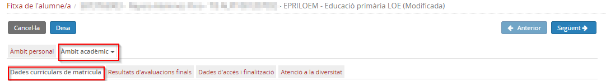
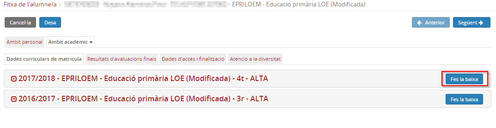
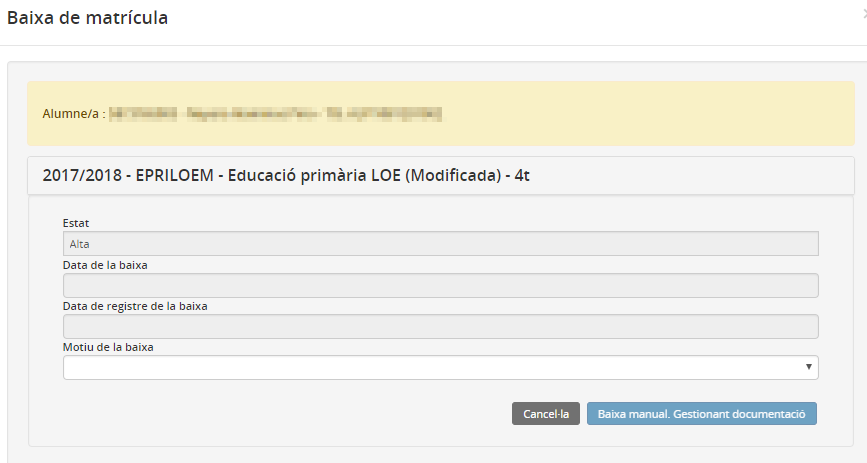
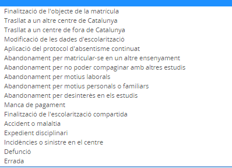
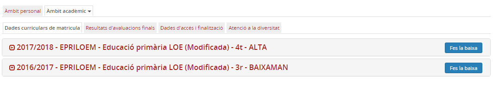
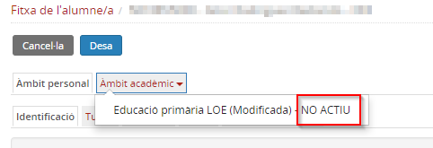
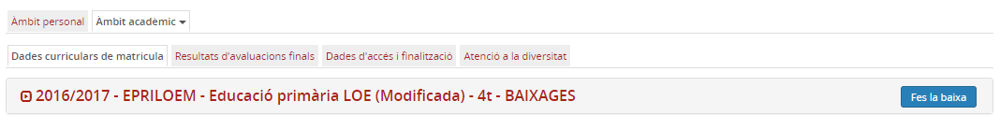
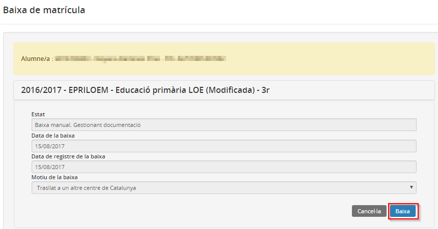
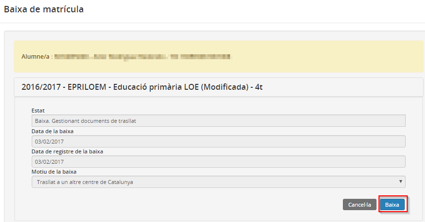

# Baixa de matrícula

* [Estats de la matrícula](index.md#estats-de-la-matricula)

  + [Alta](index.md#alta)
  + [Baixa manual gestionant documentació](index.md#baixa-manual-gestionant-documentacio)
  + [Baixa gestionant documents de trasllat](index.md#baixa-gestionant-documents-de-trasllat)
  + [Baixa](index.md#baixa)
* [Canvis d'estat de la matrícula](index.md#canvis-destat-de-la-matricula)

  + [D'Alta a Baixa manual gestionant documentació](index.md#dalta-a-baixa-manual-gestionant-documentacio)
  + [D'Alta a Baixa gestionant documents de trasllat](index.md#dalta-a-baixa-gestionant-documents-de-trasllat)
  + [De Baixa manual gestionant documentació a Baixa](index.md#de-baixa-manual-gestionant-documentacio-a-baixa)
  + [De Baixa gestionant documents de trasllat a Baixa](index.md#de-baixa-gestionant-documents-de-trasllat-a-baixa)
  + [De Baixa gestionant documents de trasllat a Alta](index.md#de-baixa-gestionant-documents-de-trasllat-a-alta)

## Estats de la matrícula

El Registre d'alumnes de Catalunya (RALC), aplicació on estan registrades totes les matrícules dels alumnes tant en centre sostinguts amb fons públics com en centres que no ho són, estableix els controls necessaris de manera que un alumne només pot tenir una matrícula en estat "Alta" per a un Ensenyament i Nivell en el mateix curs escolar.
  
  
RALC controla els estats de les matrícules. Els estats possibles són:

* **Alta**
* **Baixa manual gestionant documentació**
* **Baixa gestionant documents de trasllat**
* **Baixa**

### Alta

Un alumne que té una matrícula en estat **Alta** en un centre escolar per a un Ensenyament i Nivell en un curs escolar, és un **alumne actiu**.  
Això implica que el centre pot gestionar la seva fitxa, modificar la informació que conté, assignar-lo a un grup classe i a altres tipus de grups, avaluar-lo, etc.

### Baixa manual gestionant documentació

Un alumne que té una matrícula en estat **Baixa manual gestionant documentació** en un centre escolar per a un Ensenyament i Nivell en un curs escolar, és un **alumne no actiu**.  
Això implica que el centre únicament pot gestionar la documentació necessària per al trasllat de l'alumne a un altre centre.

### Baixa gestionant documents de trasllat

Un alumne que té una matrícula en estat **Baixa gestionant documents de trasllat** en un centre escolar per a un Ensenyament i Nivell en un curs escolar, és un **alumne no actiu**.  
Això implica que el centre únicament pot gestionar la documentació necessària per al trasllat de l'alumne a un altre centre.

### Baixa

Un alumne que té una matrícula en estat **Baixa** en un centre escolar per a un Ensenyament i Nivell en un curs escolar, és un **alumne no actiu**.  
Això implica que el centre només pot consultar la informació de la seva fitxa.
  
  

---

## Canvis d'estat de la matrícula

Quan es formalitza la matrícula d'un alumne a Esfer@, ja sigui d'un alumne nou assignat al centre o una matrícula per continuïtat, aquesta matrícula es registra a RALC i el seu estat és **Alta**.
  
  
Els canvis d'estat de la matrícula es gestionen des de la **Fitxa de l'alumne**, dins de l'opció **àmbit acadèmic**, dins de **Dades curriculars de la matrícula**:

*Imatge 1 - FDA - Àmbit acadèmic de la fitxa de l'alumne*
  
  
En aquesta pantalla es mostren les diferents matrícules de l'alumne al centre i l'estat de cadascuna. Per canviar l'estat d'una matrícula s'ha de prémer el botó [**Fes la baixa**].  

Aquesta operació és irreversible

*Imatge 2 - Matrícules de l'alumne*

### D'Alta a Baixa manual gestionant documentació

Un alumne informa el centre on es troba matriculat la seva voluntat de ser baixa pel motiu que sigui.  
En aquest cas cal canviar l'estat de la matrícula d'**Alta** a **Baixa manual gestionant documentació**.

*Imatge 3 - Canvi d'estat de la matrícula*
  
  
Cal emplenar el motiu de baixa:
  
*Imatge 4 - Motius de baixa*
  
  
La data de la baixa i la data del registre s'emplenaran automàticament en prémer el botó [**Baixa manual. Gestionant documentació**]
  
*Imatge 5 - Matrícula en estat Baixa manual. Gestionant documentació*

En aquest estat el centre ha de:

* Emplenar la documentació de l'alumne/a
* Arxivar el seu expedient, si és necessari
* Preparar la documentació de l'alumne en paper, si escau

Un alumne amb la matrícula en estat "Baixa manual. Gestionant documentació", és un alumne **No actiu**:

*Imatge 6 - Alumne No actiu. Matrícula en estat Baixa manual. Gestionant documentació*

Quan finalitza un curs escolar mai s'han de donar de baixa les matrícules dels alumnes. Aquestes baixes **es faran automàticament** per **Finalització de l'objecte de la matrícula** quan arribi el dia establert.

### D'Alta a Baixa gestionant documents de trasllat

Aquest canvi d'estat de la matrícula no el pot efectuar el centre on l'alumne té una matrícula en estat **Alta**.  
Si un altre centre (direm centre B) matricula un alumne que té una altra matrícula en estat "Alta" en un altre centre (direm centre A) pel mateix Ensenyament i Nivell, en el mateix curs escolar, la matrícula del centre A, canviarà el seu estat a **Baixa gestionant documents de trasllat**.  
És possible que el centre A, que tenia prèviament matriculat l'alumne, no tingués coneixement del seu trasllat, però aquest fet no impedeix que l'estat de la matrícula canviï.
  
*Imatge 7 - Matrícula en estat Baixa gestionant documents de trasllat.*
  
En aquesta situació es poden donar dues circumstàncies:

1. Que l'alumne realment es traslladi a l'altre centre
2. Que l'alumne no es traslladi a l'altre centre

En el primer cas, el centre A ha de:

* Emplenar la documentació de l'alumne/a
* Arxivar el seu expedient, si és necessari
* Preparar la documentació de l'alumne en paper, si escau.

En el segon cas el centre s'ha de posar en contacte amb el centre que ha matriculat l'alumne erròniament per regularitzar la situació.
  
  
Un alumne amb la matrícula en estat Baixa gestionant documents de trasllat, és un alumne **No actiu**:  
  
*Imatge 8 - Matrícula en estat Baixa gestionant documents de trasllat. Alumne no actiu.*

### De Baixa manual gestionant documentació a Baixa

Quan el centre ja ha finalitzat les tasques necessàries ha de canviar l'estat de la matrícula de **Baixa manual gestionant documentació** a **Baixa**.
  
  
*Imatge 9 - Baixa.*

### De Baixa gestionant documents de trasllat a Baixa

Si l'alumne, realment es trasllada a un altre centre, un cop finalitzades les tasques necessàries cal canviar l'estat de la matrícula de **Baixa gestionant documents de trasllat** a **Baixa**.
  
  
*Imatge 10 - Baixa.*

### De Baixa gestionant documents de trasllat a Alta

Si la nova matrícula de l'alumne a un altre centre ha estat una errada i, en realitat, l'alumne segueix matriculat en el primer centre, el centre que ha provocat el canvi d'estat de la matrícula ha de donar de baixa la seva matrícula canviant-la d'**Alta** a **Baixa manual gestionant documentació** amb el motiu **Errada**, i, a continuació fer el següent canvi de l'estat **Baixa manual gestionant documentació** a **Baixa**.  
Aquesta actuació modificarà de nou l'estat de la matrícula de l'alumne en el primer centre de Baixa gestionant documents de trasllat a **Alta**.

---