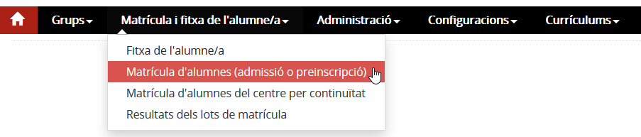
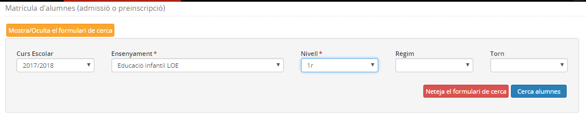
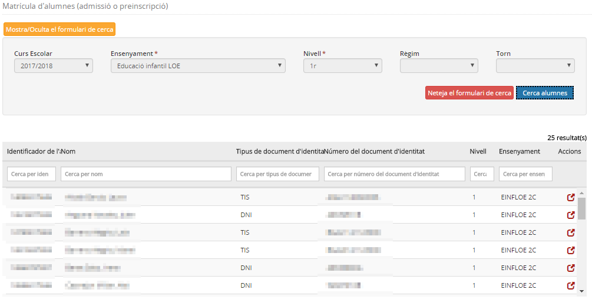
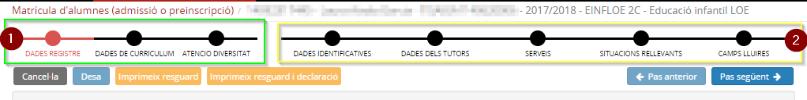
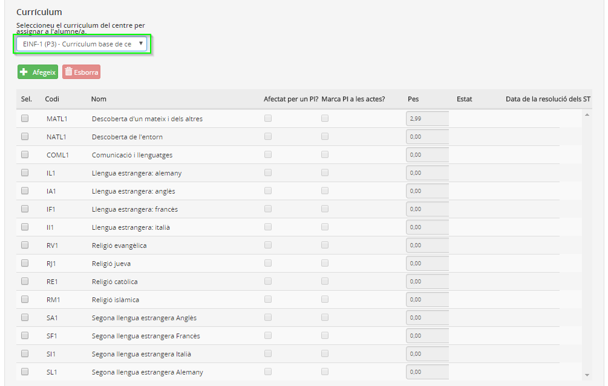
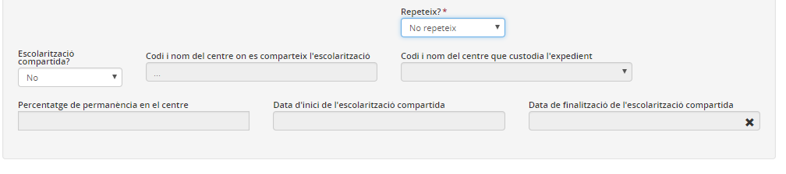
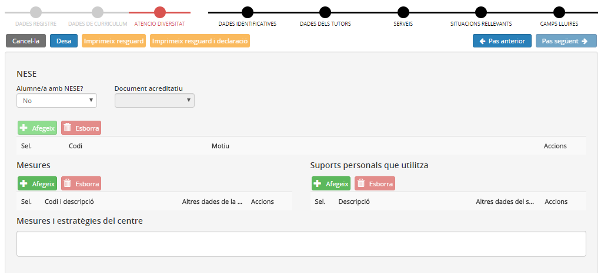
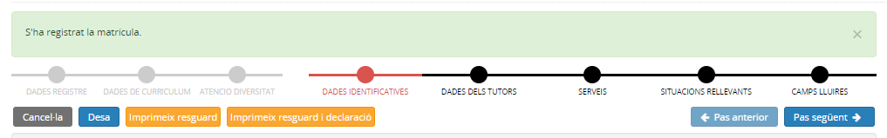

# Matrícula d'alumnes d'admissió o preinscripció

* [Què és](index.md#què-és)
* [Com s'hi accedeix](index.md#com-shi-accedeix)
* [Quines operacions s'hi poden fer](index.md#quines-operacions-shi-poden-fer)

## Què és

Aquesta opció permet matricular alumnes que provenen del procés d'admissió o de preinscripció i a qui se'ls ha assignat una plaça al centre. L'aplicació que fa l'assignació és GEDAC (Gestió d'escolarització d'alumnes de Catalunya).
  
  
 

---

## Com s'hi accedeix

S'ha d'escollir l'opció **Matrícula d'alumnes d'admissió/preinscripció** del mòdul **Matrícula i fitxa de l'alumne/a**.
*Imatge 1 - Accés al menú Matrícula d'alumnes (d'admissió o preinscripció)*
  
 

---

## Quines operacions s'hi poden fer

* [Seleccionar els alumnes](index.md#seleccionar-els-alumnes)
* [Executar l'assistent de matrícula](index.md#executar-lassistent-de-matrícula)
* [Comprovar el currículum dels alumnes](index.md#comprovar-el-currículum-dels-alumnes)

Quan es va a iniciar la matrícula d'alumnes assignats en el procés de preinscripció pel curs següent, és convenient haver modificat prèviament el paràmetre en **Curs defecte matrícula** de l'opció del menú **Paràmetres del centre** del mòdul **Configuracions**.

#### Seleccionar els alumnes

Per visualitzar els alumnes és necessari determinar els filtres dels alumnes que es volen mostrar.

1. Determinar el **curs escolar** al qual es vol fer les matrícules.
2. Indicar l'**ensenyament** del qual es cerquen alumnes assignats.
3. Indicar el **nivell** del qual es cerquen alumnes assignats.
4. Indicar **règim** i **torn**, només pels ensenyaments que tinguin règims i torns diferenciats.

*Imatge 2 - Cerca d'alumnes assignats*
  
En prémer el botó [**Cerca**] es mostrarà la relació d'alumnes assignats que corresponguin als paràmetres indicats en el filtre.
  
  
*Imatge 3 - Resultat de la cerca d'alumnes assignats*
  
  
 

---

#### Executar l'assistent de matrícula

Els alumnes assignats pel procés de preinscripció o admissió al llarg del curs només es poden matricular de manera individual.

  
En seleccionar l'alumne que es vol matricular clicant la icona de la columna "**Accions**" es posarà en funcionament l'assistent de matrícula.
  
El fil d’Ariadna mostrarà la informació següent:

* Identificador de l’alumne/a
* Cognoms i nom de l’alumne/a
* Document d’identificació de l’alumne (si en té)
* Curs escolar
* Codi i nom de l’ensenyament

*Imatge 4 - Assistent de matrícula*
  
  
L'assistent, tal com es mostra a la imatge anterior, diferencia el procés en dues parts:

1. Matrícula
2. Compleció de dades a la fitxa de l'alumne

##### Matrícula

La matrícula requereix únicament tres passos:
  
  
a) **Dades registre**
  
En aquesta pantalla es mostren totes les dades registrals de l'alumne: dades personals, dades d'identificació de l'alumne, dades de localització i contactes de l'alumne.
En aquesta pantalla es mostren les dades que consten a RALC.
  

Un centre no pot modificar les dades del registre RALC d'un alumne fins que aquest està matriculat al centre. Per aquest motiu les dades, en aquest moment, estan bloquejades.

  
  
Un cop verificat que aquest és l'alumne que es vol matricular s'accedeix al segon pas: o bé clicant el botó [**Pas següent**] o bé clicant la segona "**estació**" de l'assistent de matrícula.
  
  
b) **Dades de currículum**
  
En aquesta pantalla cal indicar el **currículum** corresponent a la matrícula de l'alumne que es vol formalitzar.
  

Prèviament cal haver definit els currículums de centre al mòdul "**Currículums**".

  
  
*Imatge 5 - Currículum de l'alumne*
  
  
En seleccionar un currículum de centre del desplegable es carregaran a la fitxa de l'alumne tots els elements curriculars que en formen part.
  
  

Si el centre utilitza un currículum ampli que mostra totes les opcions possibles, com per exemple de religió i llengües estrangeres, serà necessari eliminar els elements curriculars que l'alumne no cursarà.

  
Per a fer-ho s'hauran de seleccionar els elements que es volen eliminar i a continuació prémer el botó [**Esborra**].
  
  
En aquest pas també és necessari indicar si l'alumne **repeteix** o no el nivell, i les dades d'**escolarització compartida** si és el cas.
  
  
*Imatge 6 - Repeteix? i Escolarització compartida*
  
En acabar cal accedir al **pas següent**.
  
  
c) **Atenció diversitat**
  
Es poden especificar les dades relatives a l'atenció a la diversitat.
  
En aquest apartat s'inclouen, segons els ensenyaments:

* **Dades de les Necessitats específiques de suport educatiu (NESE)**: si l'alumne en té, cal indicar el document acreditatiu, i el motiu o motius d'aquestes NESE.
* **Mesures**: indicant la mesura o mesures corresponents, si és el cas, i tota la informació complementària que cada mesura requereixi.
* **Suports**: indicant el suport o suports que l'alumne disposarà, si escau, i la informació complementària que cada suport requereixi.
* **Pla individualitzat (PI)**: indicant el motiu del PI, i les dates d'inici de vigència i de signatura. Si es vol també es pot adjuntar el document del PI.
* **Mesures i estratègies del centre**: on es poden indicar altres mesures i suports que no estiguin recollits en els apartats anteriors.

Només es podran assignar a l'alumne les mesures i suports que el centre hagi seleccionat a l'opció del menú **Atenció a la diversitat** del mòdul **Configuracions**. És important, per tant, la seva revisió i configuració prèvia.

  
  
Segons els ensenyaments hi haurà altres passos específics com ara les especificitats dels cicles formatius o les dades que afecten els preus públics.
  
  
*Imatge 7 - Atenció diversitat*
  
  
En aquest moment cal clicar el botó [**Desa**] que realitzarà dues accions:

* Desarà la matrícula de l'alumne a Esfera
* Registrarà la matrícula a RALC

*Imatge 8 - Informació de l'actuació*
  
Un cop desada la matrícula els botons  i , que hi ha a la part superior, es mostraran actius.

* **Resguard de la matrícula**: S'obté el resguard segons l'alumne s'ha matriculat al centre d'un ensenyament, nivell, règim i torn. A més, conté les dades curriculars de la matrícula.
* **Resguard de la matrícula i declaració**: S'imprimeix el resguard de la matrícula i també una declaració assegurant que s'ha llegit la carta de compromís amb el centre, que la família ha de signar.

##### Compleció de dades a la fitxa de l'alumne

Un cop la matrícula ha estat formalitzada amb èxit, l'usuari ha de completar altres dades de la fitxa de l'alumne i/o modificar les dades registrals dins dels paràmetres que RALC permeten.
  
  
El segon bloc de l'assistent de matrícula mostra la llista dels blocs de dades que s'han de completar. **Es poden completar en aquest moment o més endavant**. Cal tenir en compte que en la formalització de la matrícula no s'han emplenat dades dels tutors, ni la llengua materna ni les llengües que entén l'alumne, per tant serà imprescindible informar-les.

* [Dades identificatives](../../../mgac/fda/fda-ap-identificacio.md)
* [Dades dels tutors](../../../mgac/fda/fda-ap-tutors.md)
* [Dades dels serveis de menjador i transport](../../../mgac/fda/fda-ap-serveis.md)
* [Situacions rellevants de l'alumne/a](../../../mgac/fda/fda-ap-sit_rellevants.md)
* [Camps lliures](../../../mgac/fda/fda-ap-camps_lliures.md)
* [Contactes](../../../mgac/fda/fda-ap-contactes.md)

Una vegada s'han matriculat els alumnes, s'han de distribuir en els **Grups classe**.

.
  
 

#### Comprovar el currículum dels alumnes

En finalitzar la matrícula dels alumnes es pot [comprovar el seu currículum](http://educacio.gencat.cat/portal/page/portal/EducacioIntranet/Inici/PortalCentres/pcGestioAdministrativa/Detall)

---