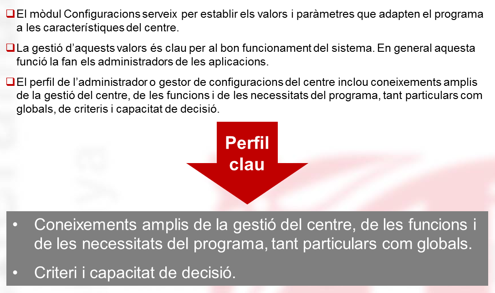
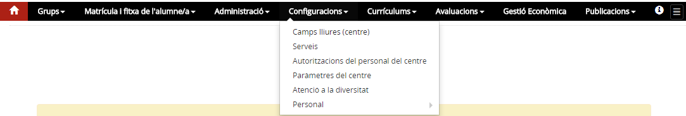

# Configuracions

* [Contextualització](index.md#contextualitzacio)
* [Funcions](index.md#funcions)
* [D’on venen les dades](index.md#don-venen-les-dades)
* [A quin lloc de l’aplicació es fan servir aquestes dades](index.md#a-quin-lloc-de-laplicacio-es-fan-servir-aquestes-dades)
* [Qui hi pot accedir](index.md#qui-hi-pot-accedir)
* [Com s’hi accedeix](index.md#com-shi-accedeix)
* [Organització](index.md#organitzacio)

### Contextualització

L'activitat docent del centre s'organitza en funció del projecte educatiu de cada centre. Les característiques de cada centre es poden plasmar a l'aplicació mitjançant uns paràmetres.

Cal configurar correctament tots els camps d'aquest mòdul, i actualitzar-los d'acord a les diferents necessitats i moments de la gestió del centre.

  
*Imatge 1 - Característiques del mòdul Configuracions*

---

### Funcions

Aquest mòdul permet adaptar el programa a les característiques del centre. Per fer això, el centre ha de definir:

* els camps lliures de centre
* els serveis que el centre ofereix: transport i menjador
* les autoritzacions, extraordinàries, d'accés al personal
* els paràmetres de curs escolar en el centre
* les mesures i suports personals d'atenció a la diversitat
* llistes de personal i gestió de la dedicació del personal del centre
* les mesures flexibilitzadores de la formació professional

 

---

### D'on venen les dades

Algunes dades, com els suports personals d'atenció a la diversitat i l'autorització de determinades mesures flexibilitzadores, vénen dels sistemes d'informació departamentals.

---

### A quin lloc de l’aplicació es fan servir aquestes dades

Les dades es fan servir a diferents llocs de l'aplicació, com:

* fitxa de l'alumne
* mòdul del personal
* mòdul de matrícula
* mòdul d'avaluació

Per altra banda, les autoritzacions afecten els permisos i accessos del personal del centre dins d'Esfer@.

---

### Qui hi pot accedir?

* El director o directora i l'equip directiu.

---

### Com s’hi accedeix

*Imatge 1 - Accés al menú Configuracions*

---

### Organització

Està organitzat en els submòduls següents:

* [Camps lliures](../../../mgac/cnf/cnf-c_ll.md)
* [Serveis](../../../mgac/cnf/cnf-ser.md)
* [Autoritzacions del personal del centre](../../../mgac/cnf/cnf-aut_pc.md)
* [Paràmetres del centre](../../../mgac/cnf/cnf-param_centre.md)
* [Mesures flexibilitzadores](../../../mgac/cnf/cnf-mes_flex.md)
* [Atenció a la diversitat](../../../mgac/cnf/cnf-at_div.md)
* [Personal](../../../mgac/cnf/cnf-pers.md)

