# Sessió d'avaluació

* [Què és](sessio_crear.md#què-és)
* [Com s'hi accedeix](sessio_crear.md#com-shi-accedeix)
* [Quines operacions s'hi poden fer](sessio_crear.md#quines-operacions-shi-poden-fer)

### Què és

Des d'aquest submòdul es fan els canvis d'estat de la sessió d'avaluació.

Es pot passar de l’estat equip docent a l’estat sessió i retrocedir l’estat de sessió a equip docent.  
La resta de canvis d'estat sempre van endavant; **no és possible retornar a un estat anterior.**

### Com s'hi accedeix

Per accedir-hi, heu de seleccionar l'opció de menú **Sessió d'avaluació** del submòdul **Avaluacions finals** del mòdul **Avaluacions**.

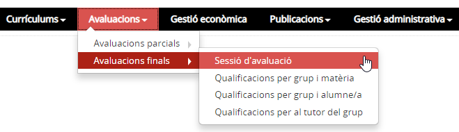*Imatge 1 - Accés al menú d'Avaluacions finals*

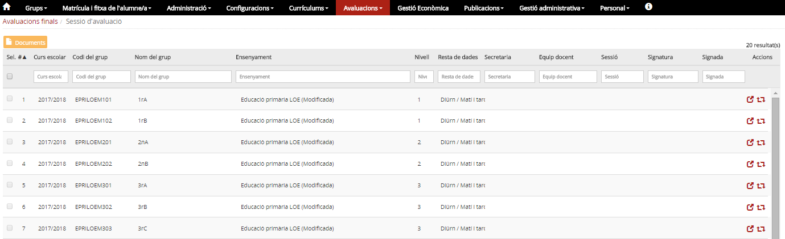*Imatge 2 - Llista de grups classe i sessions d'avaluació final*

La pantalla anterior mostra la taula de grups i sessions d'avaluació:

* Té una capçalera amb els camps: **Curs escolar**, **Codi del grup**, **Nom del grup**, **Ensenyament**, **Nivell**, **Resta dades** [1)](sessio_crear.md#1), **Secretaria**, **Equip docent**, **Sessió**, **Signatura**, **Signada** i **Accions**.
* Hi ha camps en blanc per poder delimitar la cerca.
* Hi ha una fila per cada un dels grups classe del centre, per al curs escolar que s'hagi establert com a **Curs defecte d'avaluació** a l'opció del menú **Paràmetres del centre** del mòdul **Configuracions**
* L'estat en què es troben les sessions d'avaluació del grup s'especifica als camps: **Secretaria**, **Equip docent**, **Sessió**, **Signatura**, **Signada**.
* A la columna d'accions hi ha dues icones .

  +  Permet accedir al detall de la sessió d'avaluació per entrar-hi la data de la sessió, els acords, els assistents i altres assistents.
  +  Per crear una nova sessió d'avaluació o canviar-ne l'estat.
* A la part superior de la taula hi ha el botó , que permet generar les **Actes d'avaluació**, els **Informes de qualificacions** i l'**Acusament de recepció**.

### Quines operacions s'hi poden fer

#### Crear la sessió d'avaluació d'un grup

Per crear una sessió d'avaluació final cal:

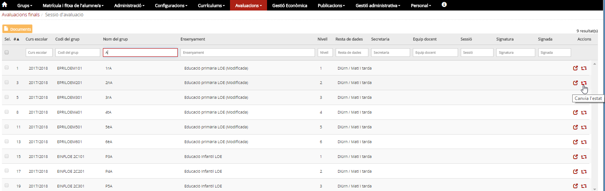*Imatge 3- Accés a la pantalla per canviar l'estat de les sessions d'avaluació d'un grup*

* Seleccionar la casella de verificació del grup a avaluar.
* Prémer la icona  que correspon al grup. [2)](sessio_crear.md#2)

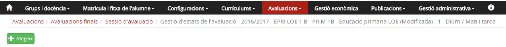*Imatge 4- Pantalla de les sessions d'avaluació d'un grup que no té cap sessió creada*

* Prémer el botó  .

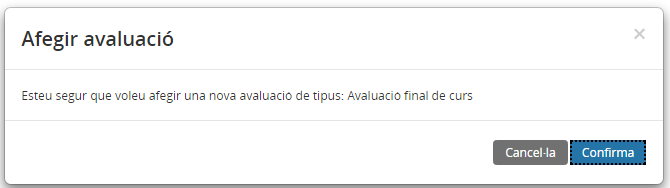*Imatge 5- Pantalla de confirmació*

* Prémer el botó .

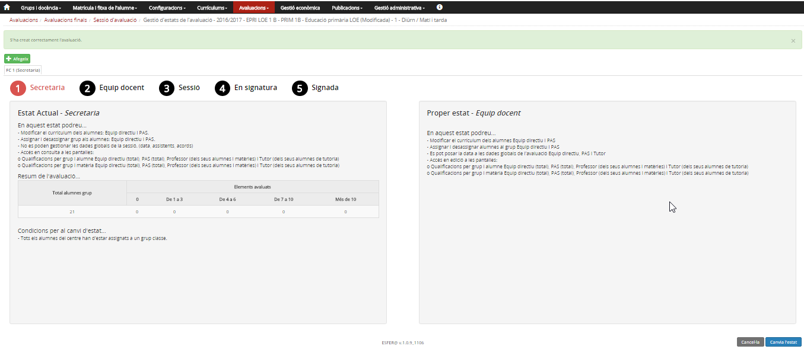*Imatge 6- Pantalla de la sessió d'avaluació en estat secretaria*
  
Es mostra la pantalla de la **sessió d'avaluació** amb:

* El missatge **S'ha creat correctament l'avaluació**.
* Cinc punts numerats que representen els estats de la sessió. L'estat actual està en vermell.
* Dues seccions informatives: **Estat actual -*Secretaria*** i **Proper estat -*Equip docent***

  + **Estat actual -*Secretaria*** amb la informació del que **En aquest estat es pot fer**, un **Resum de l'avaluació** i  **Condicions per poder fer el canvi d'estat**.
  + **Proper estat -*Equip docent*** amb la informació del que **En aquest estat es podrà fer**.
* Dos botons  .

 

---

#### Canviar l'estat d'una sessió d'avaluació d'un grup

* [Fer la petició per canviar l'estat](sessio_crear.md#fer-la-petició-per-canviar-lestat)
* [Condicions per canviar l'estat](sessio_crear.md#condicions-per-canviar-lestat)
* [Accions que es poden fer en cada estat](sessio_crear.md#accions-que-es-poden-fer-en-cada-estat)

#### Fer la petició per canviar l'estat

Per canviar l'estat d'una sessió d'avaluació final cal:

* Seleccionar l'opció del menú **Sessió d'avaluació** del submòdul **Avaluacions finals** del mòdul **Avaluacions**.
* Prémer la icona  que correspon al grup. [3)](sessio_crear.md#3)

*Imatge 7- Pantalla de la sessió d'avaluació en estat secretaria*

* Prémer el botó .

*Imatge 8- Pantalla de confirmació*

* Prémer el botó .

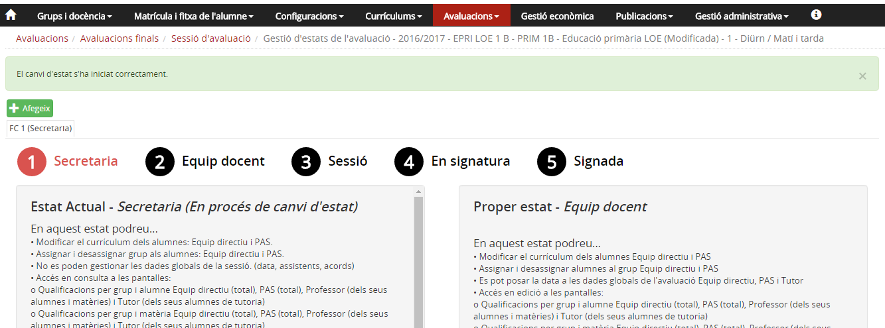*Imatge 9- Confirmació que s'ha iniciat el canvi d'estat de la sessió*
  
A la pantalla es mostra el missatge que el canvi d'estat s'ha iniciat. El canvi d'estat no és immediat, el programa ha de fer diferents accions, fet que provoca alguns canvis a la pantalla.

* Si el procés finalitza correctament, a la pantalla es mostra un missatge confirmant que el canvi d'estat s'ha efectuat correctament.
* La pantalla té la mateixa estructura que la imatge 6.

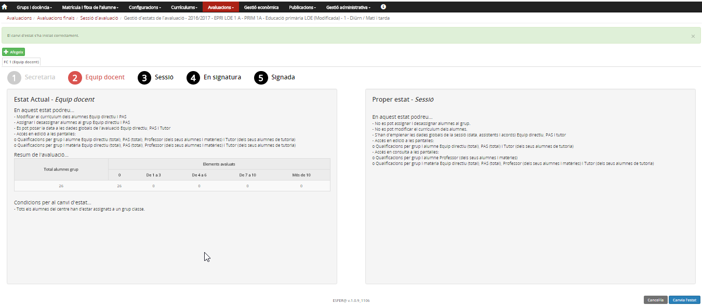*Imatge 10- Confirmació que s'ha iniciat el canvi d'estat de la sessió*

* Si no s'han superat totes les validacions [4)](sessio_crear.md#4) es mostra a la pantalla un missatge amb els problemes/errors que s'han trobat. [5)](sessio_crear.md#5)

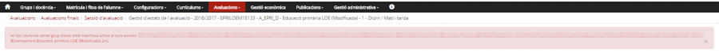*Imatge 11- Missatges d'error / Validacions de dades que han impedit fer el canvi d'estat*

* Després d'esmenar els errors torneu a prémer el botó .

Per retrocedir de l’estat sessió a l’estat equip docent cal:

* Prémer el botó 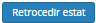
* Prémer el botó Confirma de la finestra emergent.

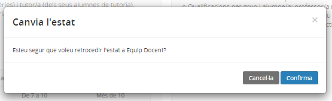*Imatge 12- Pantalla de confirmació*

 

---

#### Condicions per canviar l'estat

| Canvi d'estat | Condicions |
| --- | --- |
| Secretaria –> Equip docent | Tots els alumnes del centre han d'estar assignats a un grup classe. |
| Equip docent ←→ Sessió | Tots els alumnes del centre han d'estar assignats a un grup classe. |
| Sessió –> En signatura | Tots els alumnes del centre han d'estar assignats a un grup classe. |
| S'ha d'haver especificat totes les dades d'avaluació dels alumnes del grup. |
| En signatura –> Signada | Tots els alumnes del centre han d'estar assignats a un grup classe. |
| S'han d'haver especificat totes les dades d'avaluació dels alumnes del grup. |
| S'ha d'haver especificat la data de sessió d'avaluació i els professors assistents. |

 

---

#### Accions que es poden fer en cada estat

| Estat | Rol | Accions que es poden fer |
| --- | --- | --- |
| Secretaria | Equip directiu i secretaria | Si és necessari, modificar el currículum dels alumnes, assignar/desassignar alumnes al grup. |
| Equip directiu i secretaria. [6)](sessio_crear.md#6)Els professors. [7)](sessio_crear.md#7)El tutor/a [8)](sessio_crear.md#8) | Accedir en mode consulta a l'entrada de qualificacions per grup i matèria, i per grup i alumne. |
| Equip docent | Equip directiu i secretaria | Si és necessari, modificar el currículum dels alumnes, assignar/desassignar alumnes al grup. |
| Equip directiu i secretaria amb autorització. [9)](sessio_crear.md#9)Els professors. [10)](sessio_crear.md#10)El tutor/a [11)](sessio_crear.md#11) | Accedir a l'entrada de qualificacions per grup i matèria i per grup i alumne. |
| Equip directiu i secretaria amb autorització i el tutor/a [12)](sessio_crear.md#12) | Entrar la data de la sessió d'avaluació. |
| Sessió | Els professors | Accedir en mode de consulta a l'entrada de qualificacions per grup i matèria, i per grup i alumne. |
| Equip directiu i secretaria amb autorització i el tutor/a [13)](sessio_crear.md#13) | Revisar les qualificacions i, si correspon, entrar les qualificacions globals i les conseqüències de l'avaluació. |
| Entrar la data de la sessió d'avaluació, assistents i acords. |
| En signatura | Equip directiu i secretaria amb autorització i el tutor/a [14)](sessio_crear.md#14) | Entrar la data de la sessió d'avaluació, assistents i acords. |
| Signada | Equip directiu | Si és necessari, es poden fer diligències a l'acta. |

 

---

### Entrar les dades d'una sessió d'avaluació: data, assistents i acords

Per entrar les dades d'una sessió d'avaluació cal:

* Seleccionar l'opció del menú **Sessió d'avaluació** del submòdul **Avaluacions finals** del mòdul **Avaluacions**.

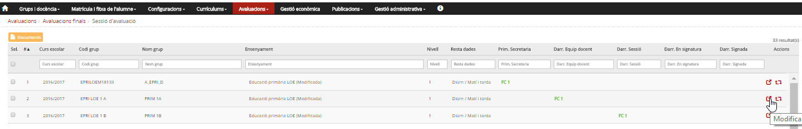*Imatge 13- Accés a l'entrada de les dades d'una sessió*

* Prémer la icona  que correspon al grup.

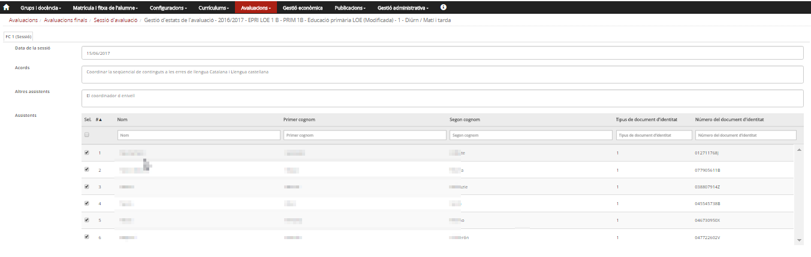*Imatge 14- Pantalla d'entrada de dades d'una sessió*
  
A la pantalla introduir:

* La **data de la sessió** d'avaluació.
* Els **acords** de la sessió d'avaluació.
* Si a la sessió, a més dels professors del grup, hi ha **altres assistents**, es pot anotar en aquest espai.
* **Assistents**: s'han de marcar els professors assignats al grup que han assistit a la sessió d'avaluació.

Després d'entrar les dades, prémer el botó .

 

---

#### Imprimir els documents: actes, informes de qualificacions i acusament de rebut

* [Actes](sessio_crear.md#actes)
* [Butlletins](sessio_crear.md#butlletins)
* [Acusament de recepció](sessio_crear.md#acusament-de-recepció)

#### Generació dels documents

Cal anar a **Avaluacions > Avaluacions finals > Sessió d'avaluació**.

*Imatge 15 - Selecció del grup del qual es vol obtenir les actes i butlletins*

A la pantalla cal marcar la casella de verificació corresponent al grup/grups del qual es vol obtenir l'acta i/o els butlletins i clicar al botó  de la part superior.  
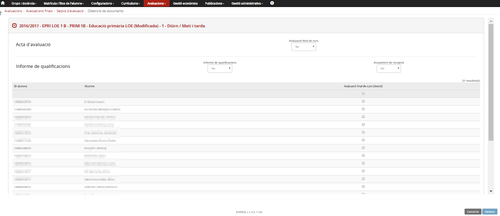*Imatge 16 - Pantalla de selecció dels documents que es volen generar.*

Si a l'ensenyament hi ha més d'una sessió d'avaluació final, s'ha d'escollir la sessió d'avaluació de què es volen generar els documents.
A la pantalla s'han de triar els documents que es volen imprimir.

#### Actes

Al desplegable **Avaluació final de curs**, cal especificar-hi un **Sí** i prémer el botó . [15)](sessio_crear.md#15) Es genera un document en format PDF.

*Imatge 17 - Acta de primària (1a part)*

*Imatge 18 - Acta de primària (2a part)*

*Imatge 19 - Acta de primària (Comentaris)*

*Imatge 20 - Acta de primària (Signatures)*

*Imatge 21 - Annex d'una acta de primària*

 

---

#### Butlletins

Al desplegable **Informe de qualificacions**, cal especificar-hi **Sí**, seleccionar els alumnes i prémer el botó . Es genera un document comprimit (ZIP) amb els informes en format PDF.

*Imatge 22 - Selecció dels alumnes per generar-ne els informes*

|  |  |
| --- | --- |
|  |  |

*Imatge 23 - Informe de qualificacions*

#### Acusament de recepció

Al desplegable **Acusament de recepció**, cal especificar-hi **Sí**, seleccionar els alumnes i prémer el botó . Es genera un document comprimit (ZIP) amb els "resguards" dels informes en format PDF.

 

[1)](sessio_crear.md#1)
Règim i torn.

[2)](sessio_crear.md#2)
Per facilitar la cerca del grup podeu utilitzar els filtres que hi ha a la capçalera.

[3)](sessio_crear.md#3)
Consulteu la Imatge 3.

[4)](sessio_crear.md#4)
Per exemple, hi ha alumnes que no estan a cap grup classe.

[5)](sessio_crear.md#5)
En aquest cas, la relació d'alumnes que no estan a cap grup classe.

[6)](sessio_crear.md#6)
De tots els alumnes.

[7)](sessio_crear.md#7)
, [10)](sessio_crear.md#10)
Només dels grups i matèries que tenen assignats.

[8)](sessio_crear.md#8)
dels alumnes del grup de tutoria.

[9)](sessio_crear.md#9)
De tots els alumnes

[11)](sessio_crear.md#11)
Dels alumnes del grup de tutoria.

[12)](sessio_crear.md#12)
, [13)](sessio_crear.md#13)
, [14)](sessio_crear.md#14)
Del grup del qual és tutor.

[15)](sessio_crear.md#15)
No cal seleccionar els alumnes.