# Sessió d'avaluació

* [Què és](sessio_crear.md#què-és)
* [Com s'hi accedeix](sessio_crear.md#com-shi-accedeix)
* [Quines operacions s'hi poden fer](sessio_crear.md#quines-operacions-shi-poden-fer)

  + [Crear o canviar la sessió d'avaluació d'un grup](sessio_crear.md#crear-o-canviar-la-sessió-davaluació-dun-grup)
  + [Entrar les dades d'una sessió d'avaluació: data, assistents i acords](sessio_crear.md#entrar-les-dades-duna-sessió-davaluació-data-assistents-i-acords)
  + [Imprimir els documents](sessio_crear.md#imprimir-els-documents)

### Què és

Des d'aquest submòdul es fan els canvis d'estat de la sessió d'avaluació.

Els canvis d'estat sempre van endavant; no és possible retornar a un estat anterior.

### Com s'hi accedeix

Per accedir-hi, heu de seleccionar l'opció de menú **Sessió d'avaluació** del submòdul **Avaluacions parcials** del mòdul **Avaluacions**.

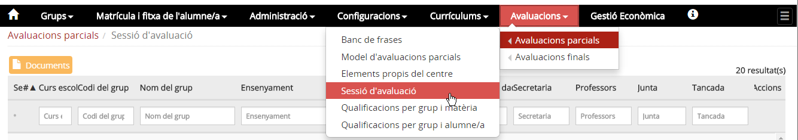*Imatge 1 - Accés a l'opció de menú Sessió d'avaluació del mòdul Avaluacions parcials*

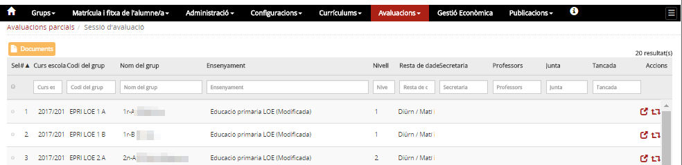*Imatge 2 - Llista de grups classe i sessions d'avaluació parcials*

La pantalla mostra la taula de grups i les sessions d'avaluació:

* Té una capçalera amb els camps: **Curs escolar**, **Codi del grup**, **Nom del grup**, **Ensenyament**, **Nivell**, **Resta dades**[1)](sessio_crear.md#1), **Secretaria**, **Professors**, **Junta**, **Tancada** i **Accions**.
* Hi ha camps en blanc per poder delimitar la cerca.
* Hi ha una fila per a cada un dels grups classe del centre, per al curs escolar que s'hagi establert com a **Curs per defecte d'avaluació** a l'opció del menú **Paràmetres del centre** del mòdul **Configuracions**.
* L'estat en què es troben les sessions d'avaluació del grup s'especifiquen als camps: **Secretaria**, **Professors**, **Junta**, **Tancada**.
* A la columna d'accions hi ha dues icones:

  +  Permet accedir al detall de la sessió d'avaluació per poder-hi entrar la data de la sessió, els acords, els assistents i altres assistents.
  +  Per crear una nova sessió d'avaluació o canviar-ne l'estat.
* A la part superior de la taula hi ha el botó , que permet generar les actes d'avaluació, els informes de qualificacions i l'acusament de recepció.

### Quines operacions s'hi poden fer

#### Crear o canviar la sessió d'avaluació d'un grup

Per crear una sessió d'avaluació parcial cal:

* Seleccionar l'opció de menú [Sessió d'avaluació](sessio_crear.md#sessió-davaluació) del submòdul **Avaluacions parcials** del mòdul **Avaluacions**.

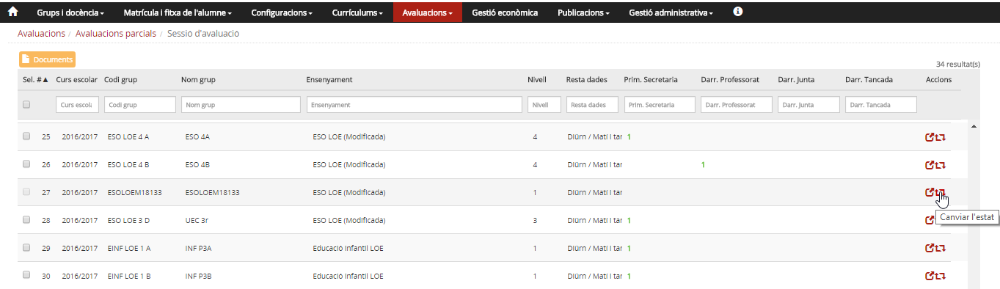*Imatge 3- Accés a la pantalla per crear o modificar l'estat de les sessions d'avaluació d'un grup*

* Prémer la icona  que correspon al grup.[2)](sessio_crear.md#2)

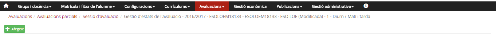*Imatge 4- Pantalla de les sessions d'avaluació d'un grup que no té cap sessió creada*

* Prémer el botó 

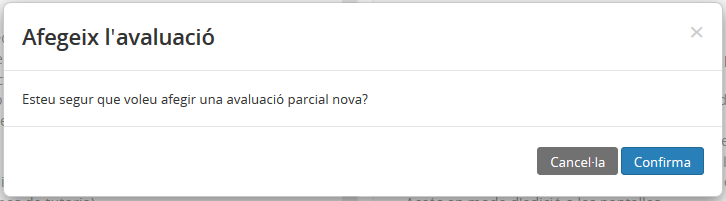*Imatge 5- Pantalla de confirmació*

* Prémer el botó 

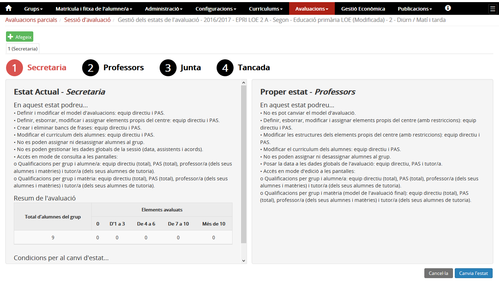*Imatge 6- Pantalla de la sessió d'avaluació en estat Secretaria*
  
Es mostra la pantalla de la **sessió d'avaluació** amb:

* Quatre punts numerats que representen els estats de la sessió. L'estat actual en vermell.
* Dues seccions informatives: **Estat actual -*Secretaria*** i **Proper estat -*Professors***

  + **Estat actual -*Secretaria*** amb la informació del que es pot fer, un resum de l'avaluació i les condicions per poder fer el canvi d'estat.
  + **Proper estat -*Professors*** amb la informació del que es podrà fer.
* Dos botons  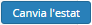.

 

---

#### Fer la petició per canviar l'estat

Per canviar l'estat d'una sessió d'avaluació parcial cal:

* Seleccionar l'opció de menú [Sessió d'avaluació](sessio_crear.md#sessió-davaluació) del submòdul **Avaluacions parcials** del mòdul **Avaluacions**.
* Prémer la icona  que correspon al grup.[3)](sessio_crear.md#3)

*Imatge 7- Pantalla de la sessió d'avaluació en estat Secretaria*

* Prémer el botó .

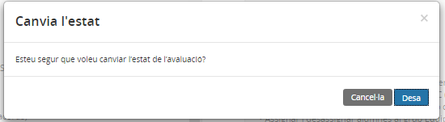*Imatge 8- Pantalla de confirmació*

* Prémer el botó .

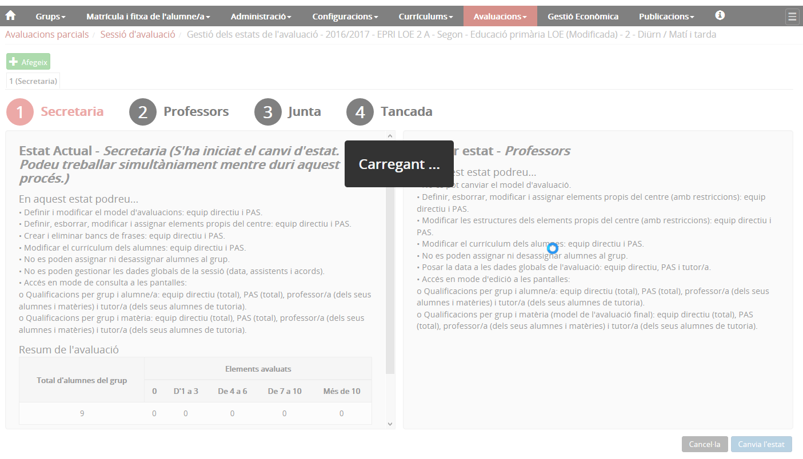*Imatge 9- Informació de què s'ha iniciat el canvi d'estat de la sessió*
  
A la pantalla es mostra el missatge que el canvi d'estat s'ha iniciat. El canvi d'estat no és immediat, el programa ha de fer diverses validacions i accions, fet que provoca alguns canvis a la pantalla.

* Si el procés finalitza correctament, a la pantalla es mostra un missatge assegurant que el canvi d'estat s'ha efectuat correctament.
* La pantalla té la mateixa estructura que la imatge 6.

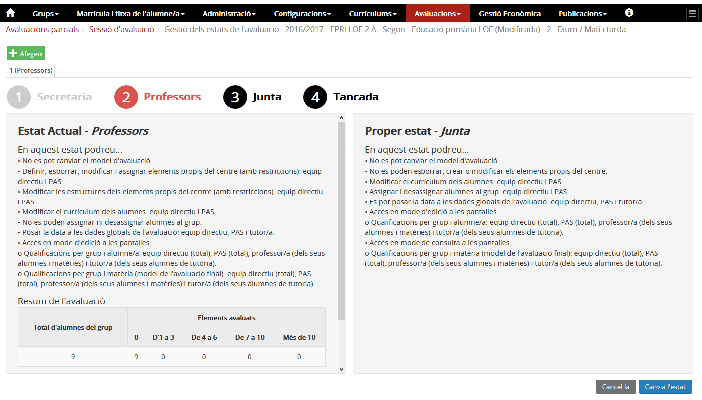*Imatge 10- Informació de què s'ha iniciat el canvi d'estat de la sessió*

* Si no s'han superat totes les validacions[4)](sessio_crear.md#4) es mostra a la pantalla un missatge amb els problemes/errors que s'han detectat.[5)](sessio_crear.md#5)

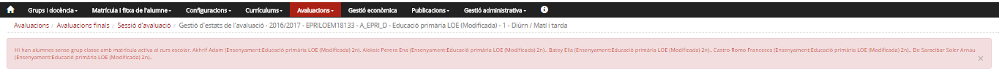*Imatge 11- Problemes que han impedit fer el canvi d'estat*

* Després d'esmenar els errors podeu tornar a prémer el botó .

 

---

#### Condicions per canviar l'estat

| Canvi d'estat | Condicions |
| --- | --- |
| Secretaria –> Professors | Tots els alumnes del centre han d'estar assignats a un grup classe. |
| Professors –> Junta | Tots els alumnes del centre han d'estar assignats a un grup classe. |
| Junta –> Tancada | Tots els alumnes del centre han d'estar assignats a un grup classe, i a més s'ha d'haver completat les dades de la sessió d'avaluació referents a data, assistents i acords. |

 

---

#### Accions que es poden fer en cada estat

| Estat | Rol | Accions que es poden fer |
| --- | --- | --- |
| Secretaria | Equip directiu i secretaria | Si és necessari, modificar els elements propis del centre, assignar/desassignar alumnes al grup. |
| Equip directiu i secretaria.[6)](sessio_crear.md#6) Els professors.[7)](sessio_crear.md#7) El tutor/a [8)](sessio_crear.md#8) | Accedir en mode consulta a l'entrada de qualificacions per grup i matèria[9)](sessio_crear.md#9) i per grup i alumne. |
| Professors | Equip directiu i secretaria | Si és necessari, modificar els elements propis del centre i les frases, assignar/desassignar alumnes al grup. |
| Equip directiu i secretaria amb autorització.[10)](sessio_crear.md#10) Els professors.[11)](sessio_crear.md#11) El tutor/a [12)](sessio_crear.md#12) | Entrar qualificacions per grup i matèria[13)](sessio_crear.md#13), i per grup i alumne. |
| Equip directiu i secretaria amb autorització i el tutor/a[14)](sessio_crear.md#14) | Entrar la data de la sessió d'avaluació. |
| Junta | Els professors | Accedir en mode de consulta a l'entrada de qualificacions per grup i matèria[15)](sessio_crear.md#15), i per grup i alumne. |
| Equip directiu i secretaria amb autorització i el tutor/a[16)](sessio_crear.md#16) | Revisar les qualificacions i, si correspon, entrar les qualificacions globals. |
| Entrar la data de la sessió d'avaluació, els assistents i els acords. |
| Tancada | Equip directiu i secretaria amb autorització i el tutor/a[17)](sessio_crear.md#17) | Entrar la data de la sessió d'avaluació, els assistents i els acords. |

 

---

#### Entrar les dades d'una sessió d'avaluació: data, assistents i acords

Per entrar les dades d'una sessió d'avaluació cal:

* Seleccionar l'opció del menú [Sessió d'avaluació](sessio_crear.md#sessió-davaluació) del submòdul **Avaluacions parcials** del mòdul **Avaluacions**.

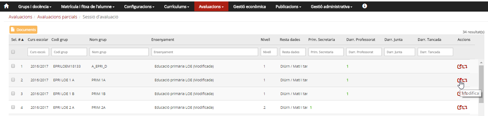*Imatge 12- Accés a l'entrada de les dades d'una sessió*

* Prémer la icona  que correspon al grup.

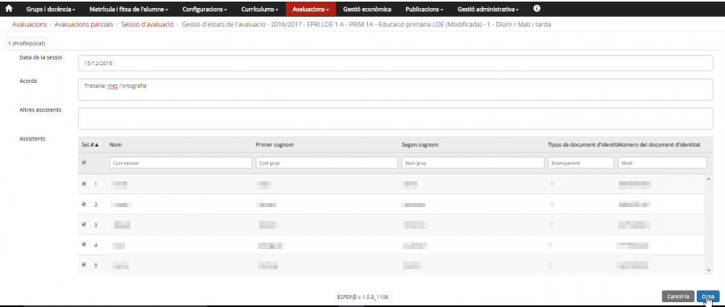*Imatge 13- Pantalla d'entrada de dades d'una sessió d'avaluació*
  
A la pantalla s'ha d'introduir:

* La **data de la sessió** d'avaluació.
* Els **acords** de la sessió d'avaluació.
* Si a la sessió, a més dels professors del grup, hi ha **altres assistents**, es pot anotar en aquest espai.
* **Assistents**: S'han de marcar els professors assignats al grup que han assistit a la sessió d'avaluació.

Després d'entrar les dades, prémer el botó .

 

---

### Imprimir els documents

#### Generació de documents

* [Actes](sessio_crear.md#actes)
* [Butlletins i acusament de recepció](sessio_crear.md#butlletins-i-acusament-de-recepció)

 

#### Actes

Cal anar a **Avaluacions > Avaluacions parcials > Sessió d'avaluació**.

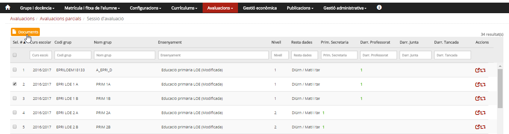*Imatge 14 - Pantalla d'accés a actes i informes de qualificacions*

A la pantalla, cal marcar la casella corresponent al grup/grups del qual es vol obtenir l'acta i/o els informes i clicar al botó  de la part superior.  
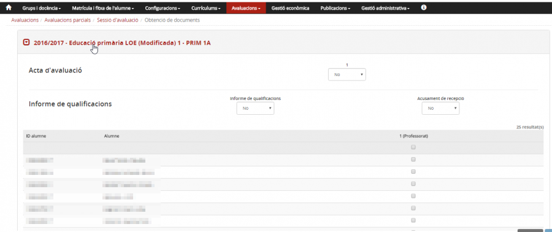*Imatge 15 - Selecció dels documents*

Si a l'ensenyament hi ha més d'una sessió d'avaluació parcial, s'ha d'escollir la sessió d'avaluació de què es volen generar els documents.
A la pantalla s'han de triar els documents que es volen imprimir.

#### Actes

Al desplegable **Avaluació parcial de curs** cal especificar-hi **Sí** i prémer el botó 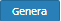.[18)](sessio_crear.md#18)
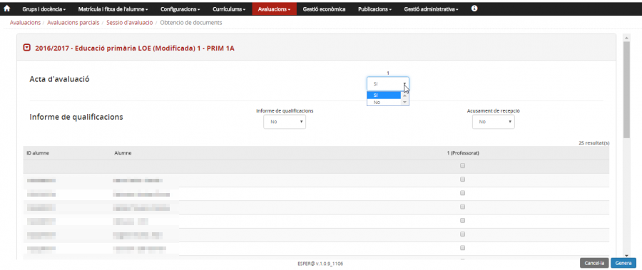*Imatge 16 - Acta de primària*

Es generen dos documents en format PDF:

* Acta de la sessió d'avaluació
* Graella de qualificacions

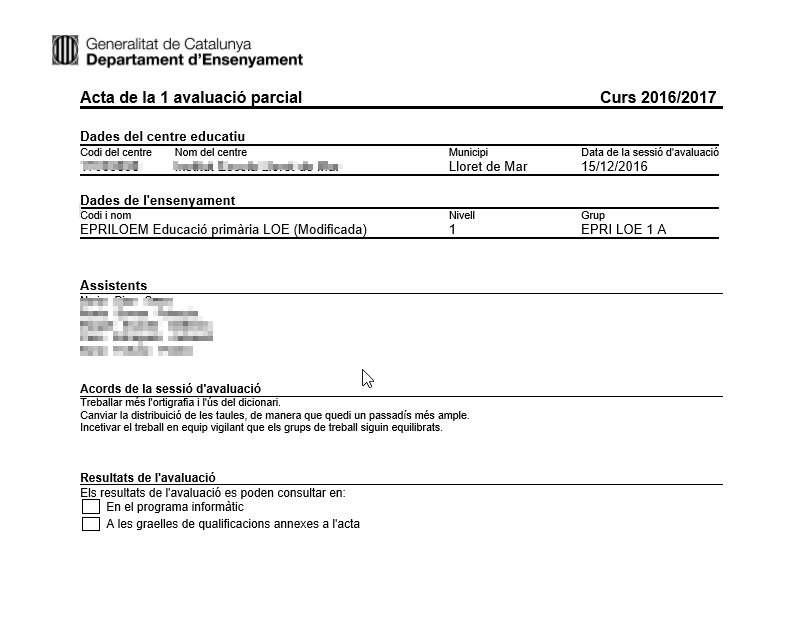*Imatge 17 - Acta de primària*

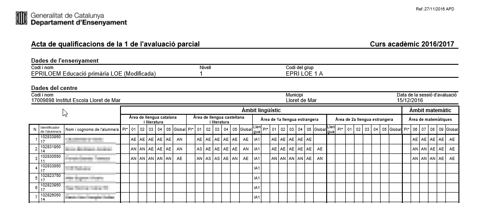*Imatge 18 - Qualificacions de primària*

#### Butlletins i acusament de recepció

Es poden imprimir els informes de qualificacions i també els d'acusament de recepció.
Al desplegable **Informe de qualificacions** cal especificar **Sí**, i al desplegable **Acusament de recepció**, també **Sí**, després de seleccionar els alumnes i prémer el botó . Després es genera un document ZIP amb els informes i els acusaments en format PDF.

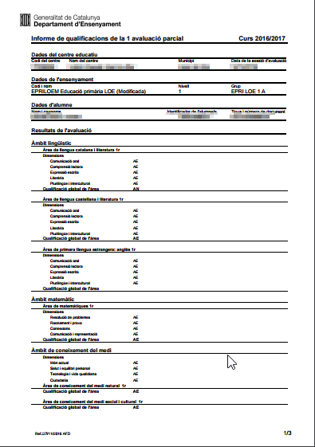*Imatge 19 - Informes de qualificacions*

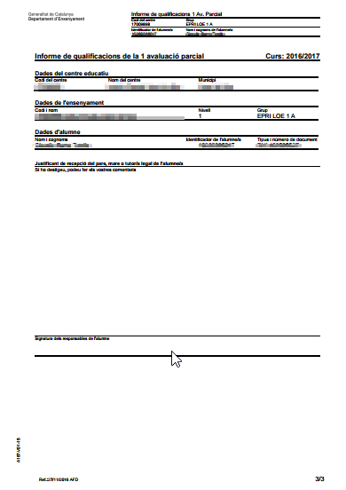*Imatge 20 - Acusament de recepció*

 

[1)](sessio_crear.md#1)
Règim i torn.

[2)](sessio_crear.md#2)
Per facilitar la cerca del grup podeu utilitzar els filtres que hi ha a la capçalera.

[3)](sessio_crear.md#3)
Consulteu la Imatge 3.

[4)](sessio_crear.md#4)
Per exemple, hi ha alumnes que no estan a cap grup classe.

[5)](sessio_crear.md#5)
En aquest cas la llista d'alumnes que no estan a cap grup classe.

[6)](sessio_crear.md#6)
, [10)](sessio_crear.md#10)
De tots els alumnes.

[7)](sessio_crear.md#7)
, [11)](sessio_crear.md#11)
Només dels grups i matèries que tenen assignats.

[8)](sessio_crear.md#8)
, [12)](sessio_crear.md#12)
Dels alumnes del grup de tutoria.

[9)](sessio_crear.md#9)
Només si les avaluacions parcials es fan com les finals

[13)](sessio_crear.md#13)
, [15)](sessio_crear.md#15)
Només si les avaluacions parcials es fan com les finals.

[14)](sessio_crear.md#14)
, [16)](sessio_crear.md#16)
, [17)](sessio_crear.md#17)
De la tutoria.

[18)](sessio_crear.md#18)
No cal seleccionar els alumnes.